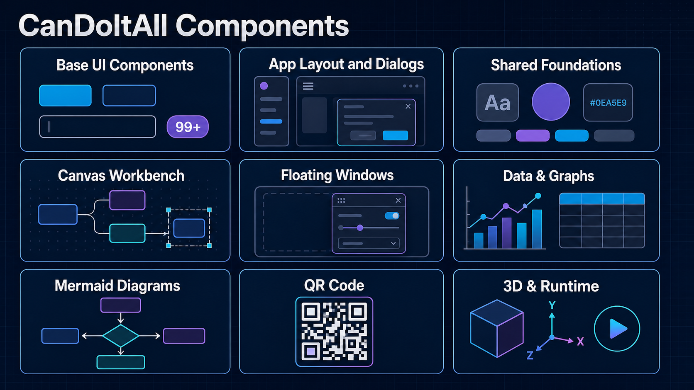
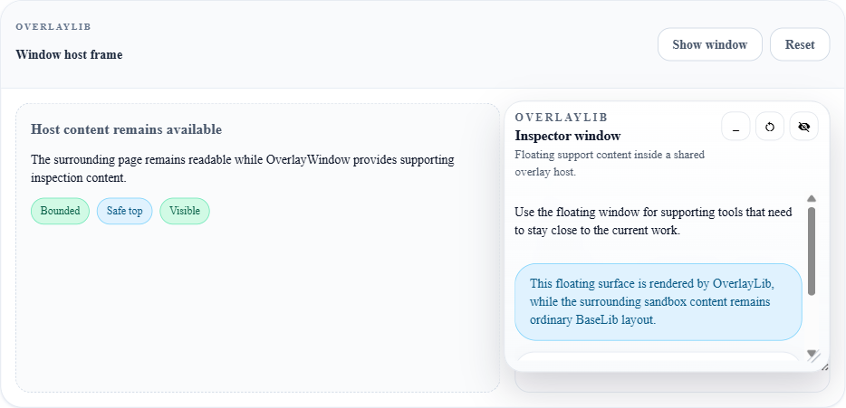

# CanDoItAll.Components

CanDoItAll.Components is a practical UI component library for Blazor applications, styled with Tailwind CSS. It gives product teams a shared set of polished building blocks: forms, navigation, feedback, diagrams, canvas workbenches, floating tools, QR flows, and WebGL scenes, so they can spend their time on product behavior instead of rebuilding UI foundations.



## Start here

Choose the smallest library that fits the surface you are building. Most applications begin with `BaseLib`; add a specialised library only when the workflow calls for it.

| Need | Start with | What it provides |
| --- | --- | --- |
| Product pages, forms, cards, navigation, dialogs, and notifications | `CanDoItAll.Components.BaseLib` | The everyday Blazor UI toolkit and shared Tailwind output. |
| Reusable layout types and non-rendering helpers | `CanDoItAll.Components.Common` | Dependency-light primitives used by the component libraries. |
| Draggable inspector panels or tool windows over ordinary UI | `CanDoItAll.Components.OverlayLib` | Bounded, draggable, resizable, minimizable floating windows. |
| Node graphs, authoring workbenches, canvas overlays, or rich calendars | `CanDoItAll.Components.CanvasLib` | A small framework for stateful, interactive workspace surfaces. |
| Charts and dashboards | `CanDoItAll.Components.Charts` | Typed chart models over Blazor ApexCharts. |
| Rendered process, architecture, or flow diagrams | `CanDoItAll.Components.Mermaid` | A typed Mermaid renderer with pan, zoom, errors, and events. |
| QR presentation and scanning flows | `CanDoItAll.Components.QRCode` | SVG QR rendering, dialogs, scan shell, and typed scan results. |
| Interactive 3D scenes and run/playback workflows | `CanDoItAll.Components.WebGlLib`, `CanDoItAll.Components.WebGlRunLib` | Domain-neutral WebGL scene and playback building blocks. |

## First Blazor page

Reference `CanDoItAll.Components.BaseLib`, import its namespace, register its services, and include the shared stylesheet in the host document. The exact package version is controlled by your application's package policy.

```csharp
// Program.cs
builder.Services.AddCanDoItAllBaseLib();
```

```razor
@* App.razor <head> *@
<link rel="stylesheet" href="_content/CanDoItAll.Components.BaseLib/css/output.css" />
```

```razor
@* Any .razor file, or _Imports.razor *@
@using CanDoItAll.Components.BaseLib

<SectionCard Title="Release review"
             Description="A ready-made surface with consistent spacing and Tailwind styling.">
    <Stack GapScale="LayoutGap.Medium">
        <StatusBadge Text="Ready for review" Tone="success" />
        <Button Text="Open review" />
    </Stack>
</SectionCard>
```

See [BaseLib](src/CanDoItAll.Components.BaseLib/README.md) for setup, service-driven overlays, and the complete component catalog.

## How the libraries work together

`BaseLib` is the visual foundation. `OverlayLib` adds generic windows that stay within a frame. `CanvasLib` composes those windows into a workbench where they are tied to a typed canvas state. Charts, Mermaid, QR, and WebGL remain optional, focused libraries with their own dependencies and host assets.

### File tooling ownership

File browsing, filesystem provider examples, and file viewing/editing now live in [CanDoItAll.FileTools](https://github.com/fyziktom/CanDoItAll.FileTools). Consumers of the former `CanDoItAll.Components.FileBrowser.*` packages should migrate to the corresponding FileTools packages. This repository intentionally has no dependency on FileTools and retains simple presentation wrappers such as Mermaid.

### Floating windows: ordinary UI vs. Canvas

Use `OverlayWindow` when a supporting tool - an inspector, search panel, queue, or live preview - should float over a bounded part of a normal page. It owns the window mechanics: placement, drag, resize, minimize, hide/show, and safe-top boundaries.

Use `CanvasFloatingWindow` inside `CanvasWorkbench.OverlayContent` when the panel belongs to a workbench. It uses the same reliable window runtime while translating the geometry and visibility into `CanvasWorkbenchWindowState`, so the application can persist or restore it beside selection, viewport, and layout state. It is not a separate window system.

| Page-local supporting tool | Canvas-owned inspector |
| --- | --- |
|  |  |
| `OverlayWindow` stays inside a normal page frame and respects its safe-top area. | `CanvasFloatingWindow` stays inside the workbench stage and participates in canvas UI state. |

The running Sandbox contains both reference examples:

- `/groups/overlays` - `OverlayWindow` over an ordinary BaseLib page frame.
- `/groups/canvas` - `CanvasFloatingWindow` over a real interactive workbench.

For the Canvas lifecycle, composition rules, and a minimal implementation, read the [Canvas guide](docs/canvas/README.md).

## Sandbox and examples

The Sandbox is the visual catalog and regression host. It is the fastest way to see components in context before adopting them.

```powershell
dotnet run --project samples/CanDoItAll.Components.Sandbox/CanDoItAll.Components.Sandbox.csproj
```

Open the printed local URL and visit `/groups/overlays`, `/groups/canvas`, `/groups/charts`, `/groups/mermaid`, or `/groups/qr`. The focused WebGL sample is in [WebGlLib-Only Viewer](samples/CanDoItAll.Components.WebGlLibOnlyViewer/README.md).

## Development

The libraries target `.NET 10`. Shared component CSS is authored with Tailwind in [`Tailwind`](Tailwind/README.md) and emitted into BaseLib's static web assets.

```powershell
npm install
npm install --prefix Tailwind
npm run tailwind:build
dotnet build CanDoItAll.Components.slnx --configuration Release
```

All library packages share the base version set by
`CanDoItAllPackageBaseVersion`. The packaging tool builds every packable
project under `src` into one clean folder and never packages samples or tests:

```powershell
.\tools\pack-packages.ps1
```

The `.nupkg` and `.snupkg` files are written to `artifacts/packages` for
manual upload through the
[fyziktom NuGet profile](https://www.nuget.org/profiles/fyziktom). For a
consumer-validation build, pass a unique prerelease suffix:

```powershell
.\tools\pack-packages.ps1 -PrereleaseSuffix "-local.20260724.1"
```

## License

This repository uses an MIT-derived license with an additional requirement
that redistributions link to the original source repository. Because that is
an extra condition, this is not the unmodified SPDX MIT license. See
[LICENSE](LICENSE) for the complete terms.

## Contributions

Code contributions are limited to partners approved by the maintainer. See
[CONTRIBUTING.md](CONTRIBUTING.md) and contact the `fyziktom` account on
LinkedIn before opening a pull request.
