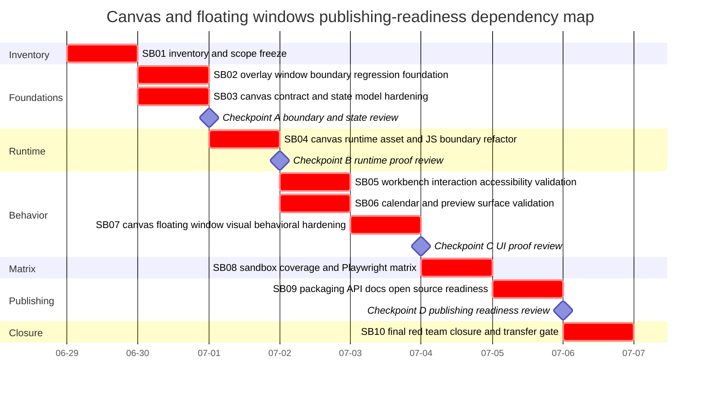

# Phase Plan

## Phase Sequence

1. SB01 freezes Canvas/Overlay scope, inventory, prior-bundle pattern, and WebGL exclusion.
2. SB02 and SB03 establish critical floating-window and Canvas state/contract foundations.
3. SB04 hardens generated asset and JavaScript runtime boundaries before UI behavior work.
4. SB05 and SB06 validate workbench, accessibility, calendar, and preview behavior.
5. SB07 hardens Canvas and Overlay floating-window behavior with open-state visual proof.
6. SB08 runs the focused sandbox and Playwright matrix across Canvas, benchmark, and overlay routes.
7. SB09 aligns packages, API snapshots, docs, README versions, generated assets, and open-source transfer guidance.
8. SB10 performs final red-team closure, raw-note audit, completed validator, and follow-up separation.

## Subbundle Dependency Map

## Critical Subbundles

- SB01 is a critical foundation because all later work depends on an accurate Canvas/Overlay inventory and WebGL exclusion boundary.
- SB02 is a critical foundation because generic floating-window behavior must remain owned by OverlayLib and reusable by CanvasLib.
- SB03 is a critical foundation because Canvas state, selection, geometry, serialization, layout, and calendar contracts feed all browser and package proof.
- SB04 is a critical foundation because generated assets and JavaScript load order must remain stable before runtime refactors and UI proof.
- SB05, SB06, and SB07 are critical UI foundations because they prove the production behavior behind workbench, calendar, accessibility, and floating-window claims.
- SB08 is a critical visual closure foundation because it verifies full sandbox coverage and route/scenario proof.
- SB09 and SB10 are critical publishing closure foundations because they prove package/API/docs readiness, raw-note closure, and fake-proof resistance.

Every critical subbundle requires a Semantic Adequacy Gate, `proof/SBxx/manifest.md`, `proof/SBxx/semantic-invariants.md`, changed-file hashes, command transcripts, source assertions, anti-stub audit, and failing-first or explicit non-behavior exemption as applicable. If any subbundle introduces or renames a production state, record, signal, or event, its manifest and semantic invariant contract must include a `## Production Behavior Artifact Matrix`.

## Phase Gates

- Prepared gate: run `python scripts/validate_bundle.py . --profile initiative --stage prepared --repo-root C:\repositories\CanDoItAll.Components` from the bundle root and repair failures.
- Entry gate for each subbundle: read root README, phase plan, requirements, traceability, current subbundle README, and current execution report before editing source.
- Checkpoint A: SB02 and SB03 closure proof must include contract tests, source assertions, and window/state roundtrip proof before runtime/UI work starts.
- Checkpoint B: SB04 closure proof must include generated-asset verification, JS syntax/runtime source assertions, and at least one browser smoke before SB05-SB07 start.
- Checkpoint C: SB05-SB07 must update browser analytics rows with route, viewport, action, screenshot paths, visual review answers, and reopen decisions before matrix proof.
- Checkpoint D: SB08-SB09 must prove visual matrix and package/API/docs readiness before SB10 final closure.
- Final closure: run completed-stage validator, audit every raw note as Solved, Partially solved, or Not solved, verify critical proof manifests, and document WebGL as separate future scope.
