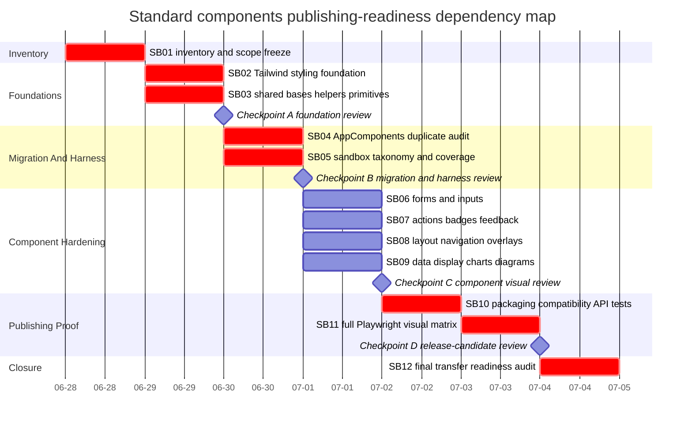

# Phase Plan

## Phase Sequence

1. SB01 freezes scope and current-state inventory, including the mandatory xlsx.
2. SB02 and SB03 establish critical styling/base foundations.
3. SB04 and SB05 compare old AppComponents and make the sandbox a trustworthy proof harness.
4. SB06 through SB09 harden standard component groups with visual proof.
5. SB10 adds publishing, compatibility, API, and test hardening.
6. SB11 runs the full Playwright visual validation matrix.
7. SB12 performs final red-team transfer readiness and raw-note closure.

## Subbundle Dependency Map

## Critical Subbundles

- SB01 is a critical foundation because all later scope and duplicate decisions depend on its inventory.
- SB02 is a critical foundation because shared Tailwind changes can affect every component screenshot.
- SB03 is a critical foundation because shared base/helper decisions control attribute merging, class composition, and primitive duplication.
- SB04 is a critical foundation because AppComponents removal can break the main app or drop old behavior.
- SB05 is a critical foundation because later Playwright proof depends on sandbox route coverage and test hooks.
- SB10, SB11, and SB12 are critical closure foundations because they determine publishing readiness and transfer risk.

Every critical subbundle requires a Semantic Adequacy Gate, `proof/SBxx/manifest.md`, `proof/SBxx/semantic-invariants.md`, command transcripts, source assertions, anti-stub audit, and failing-first or explicit non-behavior exemption as applicable.

## Phase Gates

- Prepared gate: run `python scripts/validate_bundle.py . --profile initiative --stage prepared --repo-root C:\repositories\CanDoItAll.Components` from the bundle root and repair failures.
- Entry gate for each subbundle: run the subbundle validator against root README, this phase plan, the subbundle README, and relevant traceability rows before editing source.
- Checkpoint A: SB02 and SB03 closure proof must include source assertions, build/test transcripts, and at least one dependent sandbox screenshot smoke before SB04-SB09 start.
- Checkpoint B: SB04 and SB05 must prove duplicate decisions and sandbox coverage are sufficient before group hardening starts.
- Checkpoint C: SB06-SB09 must update browser analytics rows with screenshot paths and explicit review answers before publishing hardening.
- Checkpoint D: SB10-SB11 must prove package/API/build and visual matrix readiness before SB12 closure.
- Final closure: run completed-stage validator, close each raw note as Solved, Partially solved, or Not solved, and document WebGL/Canvas follow-up separately.
