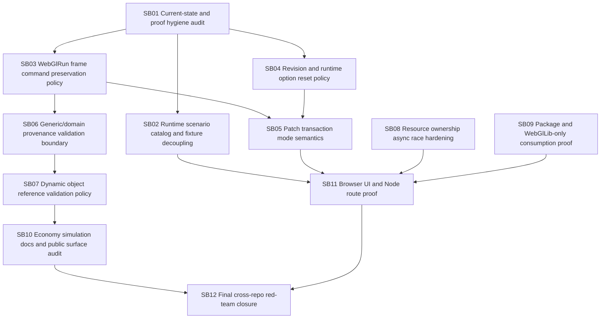

# CanDoItAll WebGL Engine + Economy Follow-up Hardening Bundle v2

Prepared date: 2026-06-02
Stage: completed
Profile: initiative / post-implementation hardening review
Target repositories:

- `fyziktom/CanDoItAll.Components` — target branch/ref: `webgl-engine`
- `fyziktom/CanDoItAll.Economy` — target branch/ref: `main`

## Purpose

The previous cross-repo WebGL/Economy hardening bundle was implemented and pushed. The implementation moved the architecture forward, but it introduced enough new surface area that a second follow-up hardening pass is required before the engine and Economy simulation stack should be treated as a stable foundation.

This bundle directs Codex to harden the remaining integration semantics, package readiness, runtime scenario loading, proof quality, and validation boundaries across both repositories.

## Current review verdict

The implementation is a good large first pass. The main architectural direction is correct:

- `WebGlLib` remains the generic scene/rendering layer.
- `WebGlRunLib` now exists as an optional generic run/playback layer above `WebGlLib`.
- Economy now maps simulation output into WebGlRunLib through `CanDoItAll.Economy.Simulation.WebGlBridge`.

The remaining risk is semantic and deployment readiness, not missing scaffolding. The top issues are runtime dependency on test fixture paths, possible silent command loss in run frames, unclear revision/runtime option policies, ambiguous patch transaction semantics, generic/domain validation tension, dynamic object reference policy, async resource disposal stress, and proof artifact hygiene.

## Critical instructions for Codex

- Work one subbundle at a time.
- Do not add domain semantics into Components packages.
- Do not close critical subbundles without failing-first and passing semantic proof.
- Do not use `tests/` fixture paths from runtime UI or Node routes.
- Do not let valid frames silently drop commands.
- Do not depend on stale global NuGet caches for package-mode proof.
- Do not treat screenshots without assertions as browser proof.
- Do not skip the refactor/gate pause after critical subbundles.

## Bundle structure

- `inputs/` preserves the raw request and source references.
- `analysis/` captures current-state findings and risks.
- `requirements/` normalizes implementation requirements.
- `architecture/` defines target boundaries and semantics.
- `plan/` contains dependency map and gates.
- `subbundles/` contains actionable execution phases.
- `proof/` contains per-subbundle proof placeholders.
- `traceability/` maps findings/requirements/source references to subbundles.
- `shared-prompts/` contains implementation and QA prompts.
- `reviews/` contains preparation self-review and execution report skeleton.
- `scripts/validate_bundle.py` provides a local prepared-stage structure check.
- `CanDoItAll_WebGlEngine_Economy_Followup_Checklists.xlsx` provides spreadsheet checklists.

## Execution order summary



## Prepared-stage validation

Run from the bundle root:

```powershell
python scripts/validate_bundle.py --stage prepared --profile initiative
```

Expected result:

```text
Bundle validation passed for stage=prepared, profile=initiative, subbundles=12
```

## Execution status

| Subbundle | Status | Gate |
| --- | --- | --- |
| SB01 | Completed 2026-06-02 | Pass; current-state inventory, proof-hygiene audit, hash baseline, command transcripts, source assertions, and anti-stub scans recorded. |
| SB02 | Completed 2026-06-02 | Pass; runtime fixture dependency removed, scenario catalog/provider added, Node content packaging proven, tests/audits/browser proof recorded. |
| SB03 | Completed 2026-06-02 | Pass; mixed direct+staged frames rejected/reported, staged-only compiler and Economy bridge output proven, `/run-playback` browser batch proof recorded. |
| SB04 | Completed 2026-06-02 | Pass; canonical revision mirror and external reset runtime-options policy documented, tested, and audited. |
| SB05 | Completed 2026-06-02 | Pass; strict and permissive invalid-link patch transaction modes documented, tested, audited, and browser-proven on `/tycoon-village`. |
| SB06 | Completed 2026-06-02 | Pass; `source.*` provenance boundary documented, generic validators tested, Economy bridge provenance preserved, and boundary audits pass. |
| SB07 | Completed 2026-06-02 | Pass; dynamic object references supported after earlier creation, same-stage motion dependencies rejected, and current Economy scenarios inventoried as static. |
| SB08 | Completed 2026-06-02 | Pass; pending GLB cache disposal diagnostics added, resource ownership harness enhanced, high-GLB recreate/dispose browser stress passed, and boundary/build gates pass. |
| SB09 | Completed 2026-06-02 | Pass; WebGlLib-only package sample, Economy WebGlBridge/Components package mode, fresh-feed isolated-cache proof, nupkg audit, and project-mode sanity builds pass. |
| SB10 | Completed 2026-06-02 | Pass; Economy README and simulation architecture docs now include simulation package map, dependency diagram, public surface, extension points, package-readiness notes, and generic reuse guardrails. |
| SB11 | Completed 2026-06-02 | Pass; Components `/run-playback` and Economy Node `/economy/simulation-sandbox` browser flows passed large+narrow viewport proof with screenshots, diagnostics JSON, console review, no fixture-path assertions, and responsive overflow fix. |
| SB12 | Completed 2026-06-02 | Pass; final cross-repo builds/tests, fresh-feed package proof, boundary/resource/fixture audits, browser proof audit, raw requirement closure, red-team sign-off, and validators pass. |

## Final validation summary

- Components Release solution build passes with 0 warnings and 0 errors.
- Economy Release solution build passes with 0 errors; existing dependency/analyzer warnings are listed in `proof/SB12/transcripts/red-team-notes-final-qa-signoff-sb12.md`.
- Focused tests pass: WebGlLib 48/48, WebGlRunLib 42/42, Economy sandbox/WebGlBridge 45/45.
- SB12 package proof uses Components package version `0.1.0-sb12.20260602.1`, fresh feed `artifacts/sb12-package-feed`, and isolated NuGet caches.
- Browser proof for `/run-playback` and `/economy/simulation-sandbox` is audited from SB11 large+narrow screenshots, diagnostics, assertions, and console logs.
- Final raw requirement closure: R01-R13 solved; R14 solved/preserved for genericity.
