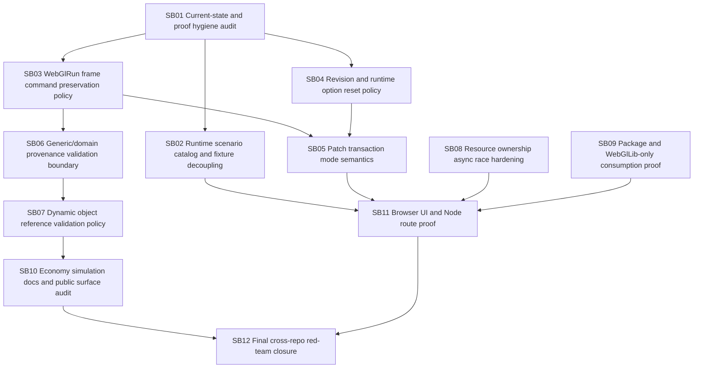

# CanDoItAll WebGL Engine + Economy Follow-up Hardening Bundle v2

Prepared date: 2026-06-02
Stage: prepared
Profile: initiative / post-implementation hardening review
Target repositories:

- `fyziktom/CanDoItAll.Components` — target branch/ref: `webgl-engine`
- `fyziktom/CanDoItAll.Economy` — target branch/ref: `main`

## Purpose

The previous cross-repo WebGL/Economy hardening bundle was implemented and pushed. The implementation moved the architecture forward, but it introduced enough new surface area that a second follow-up hardening pass is required before the engine and Economy simulation stack should be treated as a stable foundation.

This bundle directs Codex to harden the remaining integration semantics, package readiness, runtime scenario loading, proof quality, and validation boundaries across both repositories.

## Current review verdict

The implementation is a good large first pass. The main architectural direction is correct:

- `WebGlLib` remains the generic scene/rendering layer.
- `WebGlRunLib` now exists as an optional generic run/playback layer above `WebGlLib`.
- Economy now maps simulation output into WebGlRunLib through `CanDoItAll.Economy.Simulation.WebGlBridge`.

The remaining risk is semantic and deployment readiness, not missing scaffolding. The top issues are runtime dependency on test fixture paths, possible silent command loss in run frames, unclear revision/runtime option policies, ambiguous patch transaction semantics, generic/domain validation tension, dynamic object reference policy, async resource disposal stress, and proof artifact hygiene.

## Critical instructions for Codex

- Work one subbundle at a time.
- Do not add domain semantics into Components packages.
- Do not close critical subbundles without failing-first and passing semantic proof.
- Do not use `tests/` fixture paths from runtime UI or Node routes.
- Do not let valid frames silently drop commands.
- Do not depend on stale global NuGet caches for package-mode proof.
- Do not treat screenshots without assertions as browser proof.
- Do not skip the refactor/gate pause after critical subbundles.

## Bundle structure

- `inputs/` preserves the raw request and source references.
- `analysis/` captures current-state findings and risks.
- `requirements/` normalizes implementation requirements.
- `architecture/` defines target boundaries and semantics.
- `plan/` contains dependency map and gates.
- `subbundles/` contains actionable execution phases.
- `proof/` contains per-subbundle proof placeholders.
- `traceability/` maps findings/requirements/source references to subbundles.
- `shared-prompts/` contains implementation and QA prompts.
- `reviews/` contains preparation self-review and execution report skeleton.
- `scripts/validate_bundle.py` provides a local prepared-stage structure check.
- `CanDoItAll_WebGlEngine_Economy_Followup_Checklists.xlsx` provides spreadsheet checklists.

## Execution order summary



## Prepared-stage validation

Run from the bundle root:

```powershell
python scripts/validate_bundle.py --stage prepared --profile initiative
```

Expected result:

```text
Bundle validation passed for stage=prepared, profile=initiative, subbundles=12
```
