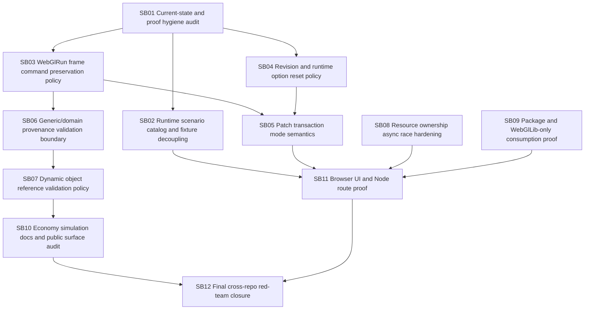

# Phase plan

## Subbundle Dependency Map

## Critical Subbundles

- SB01, SB02, SB03, SB04, SB05, SB06, SB08, SB09, SB11, SB12 are critical.
- SB07 is critical if the implementation chooses dynamic object support; otherwise it must produce an explicit static-scene policy.

## Phase Gates

| Gate | Before continuing | Required proof |
| --- | --- | --- |
| G01 | After SB01 | Proof inventory, source hash baseline, manifest quality audit. |
| G02 | After SB02 | Node/browser sandbox loads without any runtime `tests/` path. |
| G03 | After SB03 | Mixed direct+staged frame commands cannot be silently lost. |
| G04 | After SB04 | Revision and runtime option reset policy is documented, tested, and stable. |
| G05 | After SB05 | Strict and permissive patch modes are both proven. |
| G06 | After SB06/SB07 | Domain provenance and object-reference policy are explicit and enforced. |
| G07 | After SB08/SB09 | Resource and package proof passes with isolated cache and browser runtime stress. |
| G08 | After SB11 | Browser UI proof passes large screen, narrow width, Node route, and package/deployment-like scenario source. |
| G09 | After SB12 | Final validators, proof manifests, red-team review, and docs are consistent. |

## Execution rule

Codex must execute one subbundle at a time. After each critical subbundle, run the subbundle validator/gate, update proof manifests, and perform a short refactoring review before moving on.
