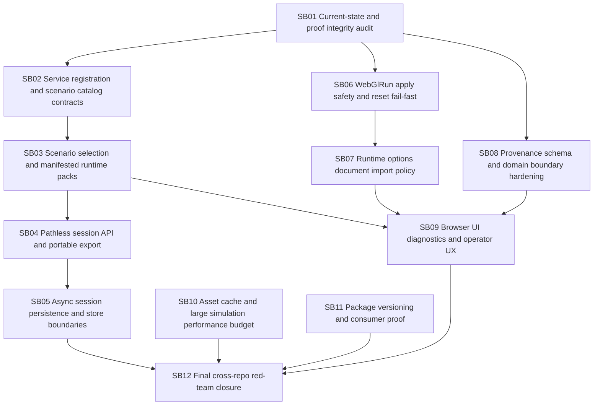

# CanDoItAll WebGL Engine + Economy Follow-up Hardening Bundle v3

Prepared date: 2026-06-02  
Stage: completed  
Profile: initiative / post-v2 implementation hardening  
Target repositories:

- `fyziktom/CanDoItAll.Components` — target branch/ref: `webgl-engine`
- `fyziktom/CanDoItAll.Economy` — target branch/ref: `main`

## Purpose

Codex implemented the v2 follow-up hardening bundle and pushed both repositories. The implementation is directionally correct and moved several issues forward, but the current public APIs and integration surfaces still need a third hardening pass before the WebGL engine + Economy simulation stack should be treated as a stable reusable foundation.

This v3 bundle focuses on:

1. proof integrity and non-empty executable evidence;
2. reusable service registration outside Node;
3. scenario packs and portable pathless session semantics;
4. fail-safe WebGlRun apply behavior;
5. runtime options preservation during browser reset/import;
6. bounded source provenance and generic/domain boundary hardening;
7. async session persistence;
8. browser/operator UX and large-simulation resource budgets;
9. final package/browser/red-team closure.

## Current review verdict

v2 solved several important problems:

- Economy sandbox now injects a runtime scenario catalog instead of hardcoding test fixture paths.
- Node registers a file-system scenario catalog and copies runtime scenario content to output/publish.
- Components now has a generic `WebGlRunLib` over `WebGlLib`.
- Validators and resource ownership improved.

Remaining risks are more subtle:

- `CanDoItAll.Economy.Components` still lacks a reusable public service-registration extension for non-Node consumers.
- Scenario/session APIs remain path-centric.
- Session persistence uses sync-over-async internally.
- `WebGlRunFrameApplyResult.FromFrame` still needs public API fail-safety when mixed direct+staged frames are passed without prior validation.
- Browser apply should fail fast on reset failure.
- Browser scene reset/import should preserve scene document runtime options.
- `source.*` provenance is useful but currently too broad.
- Large-scene performance budgets are still diagnostic rather than policy-backed.

## Critical instructions for Codex

- Work one subbundle at a time.
- Do not start downstream work until the current subbundle gate passes.
- Do not add domain semantics to Components packages.
- Do not close proof with empty transcript files.
- Do not rely on validators alone; public runtime APIs must fail safely.
- Do not use `tests/` paths from runtime UI or Node routes.
- Do not use global NuGet caches as package-consumption proof.
- Do not treat screenshots without diagnostics/assertions as browser proof.

## Bundle structure

- `inputs/` preserves the raw request and source references.
- `analysis/` captures current-state findings and risks.
- `requirements/` normalizes requirements.
- `architecture/` defines target APIs and boundaries.
- `plan/` contains dependency map and gates.
- `subbundles/` contains actionable execution phases.
- `proof/` contains per-subbundle proof placeholders.
- `traceability/` maps requirements to findings and proof.
- `shared-prompts/` contains implementation and QA prompts.
- `reviews/` contains preparation self-review and execution report skeleton.
- `CanDoItAll_WebGlEngine_Economy_Followup_v3_Checklists.xlsx` provides spreadsheet checklists.

## Execution order summary



## Prepared-stage validation

Run from the bundle root:

```powershell
python scripts/validate_bundle.py --stage prepared --profile initiative
```

Expected result:

```text
Bundle validation passed for stage=prepared, profile=initiative, subbundles=12
```

## Completed-stage validation

Run from the bundle root:

```powershell
python scripts/validate_bundle.py --stage completed --profile initiative
```

Expected result:

```text
Bundle validation passed for stage=completed, profile=initiative, subbundles=12
```
