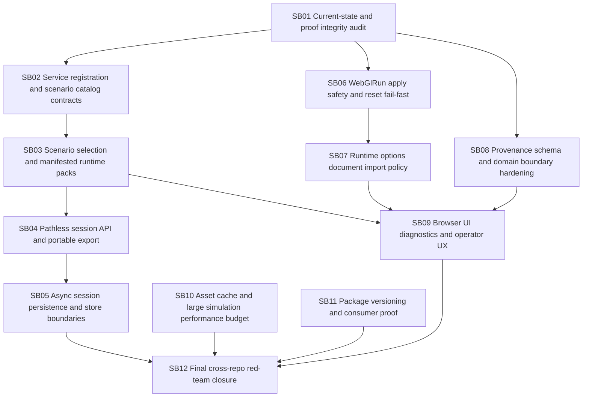

# Phase Plan

## Subbundle Dependency Map

## Critical Subbundles

| Subbundle | Critical? | Why |
|---|---|---|
| SB01 | Yes | Prevents proof-theater and establishes true current state. |
| SB02 | Yes | Determines whether the component can be consumed outside Node. |
| SB03 | Yes | Defines runtime scenario-pack contract. |
| SB04 | Yes | Prevents absolute-path session lock-in. |
| SB06 | Yes | Prevents silent WebGlRun command loss and stale-scene mutation. |
| SB07 | Yes | Preserves scene document runtime semantics. |
| SB08 | Yes | Prevents domain leakage into generic Components packages. |
| SB12 | Yes | Final red-team gate. |

## Phase Gates

- After SB01, stop and update the bundle if current-state proof contradicts this plan.
- After SB03, stop and review scenario-pack API before pathless session work.
- After SB06, stop and run a browser proof that intentionally triggers reset failure and mixed-frame input.
- After SB08, stop and run both Components boundary audits and Economy provenance bridge tests.
- SB12 cannot start until all prior proof manifests are complete and non-empty.
