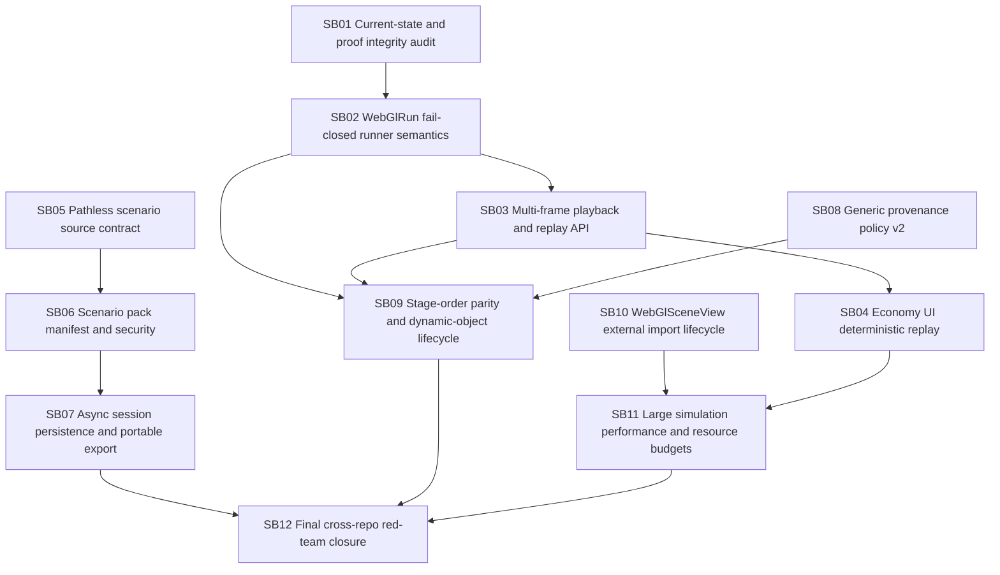

# CanDoItAll WebGL Engine + Economy Follow-up Hardening Bundle v4

Prepared date: 2026-06-02
Stage: prepared
Profile: initiative / post-v3 hardening and refactoring
Target repositories:

- `fyziktom/CanDoItAll.Components` — target branch/ref: `webgl-engine`
- `fyziktom/CanDoItAll.Economy` — target branch/ref: `main`

## Purpose

Codex completed the previous follow-up bundle and pushed both repositories. The implementation improved several high-risk areas, including browser apply fail-closed behavior, document-based scene import, runtime scenario cataloging, package proof, and validation hardening. The current solution is moving in the right direction, but the next risk layer is now visible: deterministic replay semantics, pathless scenario/session contracts, proof integrity, runtime ordering parity, and large-simulation performance.

This bundle directs Codex to harden the engine and Economy simulation stack as a reusable foundation for:

- generic visualization use cases through `CanDoItAll.Components.WebGlLib`;
- generic run/playback use cases through `CanDoItAll.Components.WebGlRunLib`;
- Economy experimental simulations in the spirit of Vernon Smith;
- future production-line and non-economy simulators.

## Current review verdict

The direction is correct, but the implementation is not yet foundation-grade for larger simulations. The most important remaining gaps are:

1. Browser/runtime replay can still be semantically wrong when a seek needs multiple frames applied, because the Economy UI applies only the current run frame.
2. `WebGlRunDocumentRunner` validates frame execution but does not explicitly fail when `WebGlRunFrameApplyResult.FromFrame` returns errors that were not caught by the execution validator.
3. Generic frame execution validation and frame application must use exactly the same stage ordering semantics.
4. Scenario catalog/session APIs are still path-centric and filesystem-bound, even though stream-based catalog methods were introduced.
5. Session export/import still stores machine-local paths and blocks on async snapshot persistence.
6. Generic provenance currently permits all `source.*` keys and values without a typed schema.
7. `WebGlSceneView` external import methods can change browser runtime state without updating the component-side scene key lifecycle.
8. Existing proof artifacts include many empty transcript files; final proof must verify non-empty semantic evidence, not just file presence.
9. Large-scene performance risks remain around full-payload serialization in `OnParametersSet`, asset cache pressure, and insufficient replay benchmarks.

## Critical instructions for Codex

- Work one subbundle at a time.
- Do not add Economy, ledger, market, production-line, station, machine, work-order, buyer, seller, price, or resource-accounting semantics to Components packages.
- Keep `WebGlLib` usable without `WebGlRunLib`.
- Do not close a critical subbundle without failing-first proof and passing semantic proof.
- Do not treat screenshots as proof unless there are assertions, runtime diagnostics, and console review.
- Do not count empty transcript files as proof.
- Do not continue after a refactor gate if any source assertion, boundary audit, or semantic invariant fails.
- Preserve public compatibility only where it is safe; mark path-based APIs as legacy if pathless APIs replace them.
- All source-code comments must be in English.

## Bundle structure

- `inputs/` preserves the user request and source-reference summary.
- `analysis/` captures current-state findings and prioritized weaknesses.
- `requirements/` normalizes implementation requirements.
- `architecture/` defines target contracts and boundaries.
- `plan/` contains the dependency map and refactor gates.
- `subbundles/` contains actionable execution phases.
- `proof/` contains required proof manifests and semantic invariants per subbundle.
- `traceability/` maps findings and requirements to implementation/proof.
- `reviews/` contains QA/self-review prompts and execution report template.
- `scripts/validate_bundle.py` performs a local prepared/completed structure check.
- `CanDoItAll_WebGlEngine_Economy_Followup_v4_Checklists.xlsx` contains detailed tracking checklists.

## Execution order summary



## Prepared-stage validation

Run from the bundle root:

```powershell
python scripts/validate_bundle.py --stage prepared --profile initiative
```

Expected result:

```text
Bundle validation passed for stage=prepared, profile=initiative, subbundles=12
```
