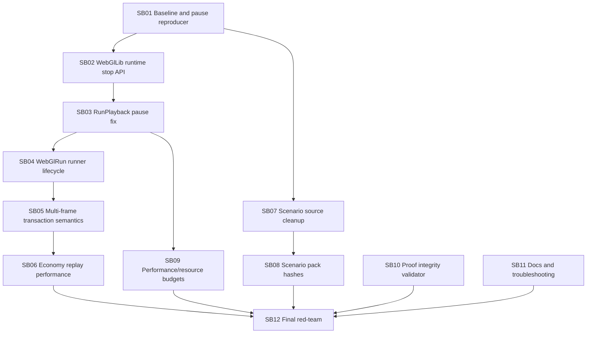

# CanDoItAll WebGL Engine + Economy Follow-up Hardening Bundle v5

Prepared date: 2026-06-03
Stage: prepared
Profile: initiative / post-v4 implementation hardening review
Target repositories:

- `fyziktom/CanDoItAll.Components` — branch/ref: `webgl-engine`
- `fyziktom/CanDoItAll.Economy` — branch/ref: `main`

## Purpose

Codex implemented the previous follow-up bundle and pushed both repositories. The architecture moved forward: multi-frame browser apply exists, scenario packs gained manifests, Economy has a scenario selector, and WebGlRun validation is stronger. However, the user found a concrete runtime bug: pressing **Pause** during a performance/playback test does not stop the scene. This bundle focuses on turning playback/cancellation into a robust, testable, generic contract instead of ad-hoc UI state.

## Current review verdict

The solution is directionally correct, but the current playback lifecycle is not yet robust enough for large simulations. The highest-risk issue is that C# playback cancellation and browser/JS runtime cancellation are not the same thing. Stopping a Blazor loop does not automatically cancel already queued command stages or active WebGL motions.

## Main weaknesses to fix

| Finding | Severity | Summary |
| --- | --- | --- |
| F01 | P0 | RunPlayback pause is not a real runtime stop |
| F02 | P0 | Playback UI event handler can monopolize component command flow |
| F03 | P0 | No public stop-all WebGL runtime operation |
| F04 | P1 | MotionCompleted callback can overwrite paused status |
| F05 | P1 | ApplyPlaybackAsync lacks playback transaction/cancellation summary |
| F06 | P1 | Economy UI deterministic replay is O(n) per step and O(n²) across long playback |
| F07 | P1 | Scenario API is improved but still path-biased |
| F08 | P1 | Scenario manifest locks only part of pack semantics |
| F09 | P1 | Proof hygiene still needs machine enforcement |
| F10 | P2 | Large simulation performance budgets are implicit |
| F11 | P2 | WebGlRun runner state lacks first-class playback lifecycle |
| F12 | P2 | Documentation needs a user-facing playback troubleshooting section |

## Critical instructions for Codex

- Work one subbundle at a time.
- Reproduce the pause bug first. Do not implement blindly.
- Do not mark pause/cancel fixed unless browser proof shows active motions and queued stages stop.
- Do not add Economy or production-line semantics into Components packages.
- Do not close critical subbundles with screenshots only; include JSON assertions and console logs.
- Do not allow zero-byte or empty proof transcripts in completed bundles.
- Preserve WebGlLib as the lightweight rendering layer; optional playback/run concerns stay in WebGlRunLib.

## Execution order



## Prepared-stage validation

Run from the bundle root:

```powershell
python scripts/validate_bundle.py --stage prepared --profile initiative
```

Expected:

```text
Bundle validation passed for stage=prepared, profile=initiative, subbundles=12
```
