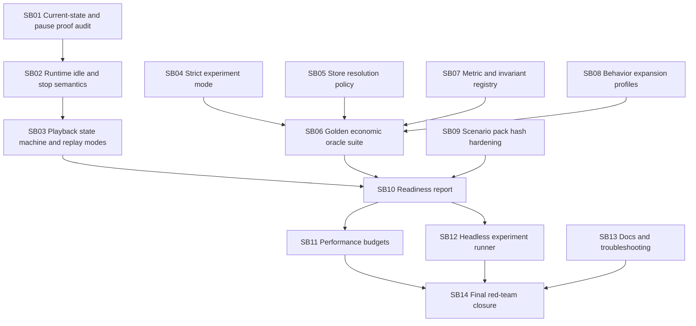

# CanDoItAll WebGL Engine + Economy Follow-up Hardening Bundle v6

Prepared date: 2026-06-03  
Stage: prepared  
Profile: initiative / experiment-trustworthiness hardening  
Target repositories:

- `fyziktom/CanDoItAll.Components` — branch/ref: `webgl-engine`
- `fyziktom/CanDoItAll.Economy` — branch/ref: `main`

## Purpose

Codex completed the previous follow-up hardening bundle and pushed both repositories. The implementation is moving in the right direction, especially around runtime stop/pause and scenario pack handling. This bundle focuses on the next, more important question:

> Can we trust economic simulation outcomes, or can simulator/runtime/projection bugs still contaminate our experiments?

The answer from this review is:

- **Yes**, the current system can be used for exploratory runs, demo scenarios, visual inspection and pipeline proof.
- **No**, it is not yet safe to treat outcomes as economic conclusions without additional strict-mode validation, oracle scenarios, metric/invariant hardening, runtime idle proof and readiness reporting.

## Critical findings

1. Pause now calls runtime stop, but we still need proof that the JS runtime is fully settled after pause.
2. `applyCommandBatch` can return after accepting/queuing work, not necessarily after all stage barriers and motions are complete.
3. Economy deterministic replay is useful for seek, but can become expensive and can blur runtime/projection/model failures.
4. Simulation warnings can still hide semantic errors in exploratory mode.
5. Store resolution has hidden economic policy through fallback and first-store selection.
6. Behavior expansion injects domain assumptions that must be explicit and versioned.
7. Unknown metrics/invariants can still behave like zero/fallback values unless made strict.
8. Existing tests are useful, but not yet a golden oracle suite for economic model primitives.

## Execution order



## Validation

Run from bundle root:

```powershell
python scripts/validate_bundle.py --stage prepared --profile initiative
```

Expected:

```text
Bundle validation passed for stage=prepared, profile=initiative, subbundles=14
```

## Deliverables

- `subbundles/SB01` through `subbundles/SB14`
- `analysis/`
- `architecture/`
- `requirements/`
- `traceability/`
- `proof/`
- `CanDoItAll_WebGlEngine_Economy_Followup_v6_Checklists.xlsx`
