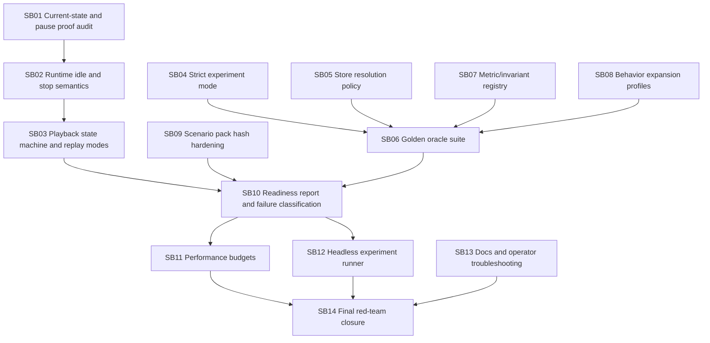

# Phase plan and dependencies

## Gate pauses

Codex must pause for a refactor/self-review after:

- SB03: runtime/playback lifecycle stabilized.
- SB06: economics oracle suite established.
- SB10: readiness report implemented.
- SB14: final closure.

No later subbundle may paper over failed invariants from an earlier subbundle.
