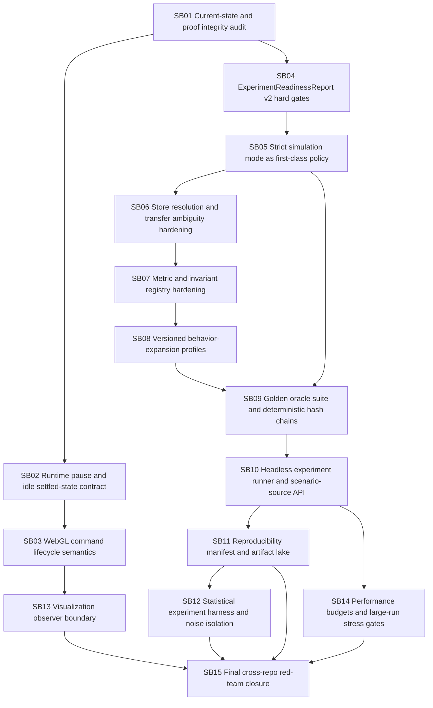

# CanDoItAll WebGL Engine + Economy Simulation Research Hardening Bundle v7

Prepared date: 2026-06-03

Stage: prepared

Profile: initiative / cross-repo post-v6 hardening and experiment-readiness review

Target repositories:

- `fyziktom/CanDoItAll.Components` — branch/ref: `webgl-engine`
- `fyziktom/CanDoItAll.Economy` — branch/ref: `main`

## Purpose

Codex implemented the previous v6 follow-up bundle and pushed both repositories. The current implementation is materially better: WebGL runtime stop APIs exist, `RunPlayback` now uses a generation/cancellation loop, Economy has scenario sources/manifests, and readiness/performance probes exist. However, the current state still needs a research-grade hardening pass before economic simulation outputs can be trusted as evidence rather than as demo/prototype signals.

This bundle focuses on removing simulator/runtime noise from economic experiments. The core objective is to ensure that when a scenario fails, succeeds, produces inequality, depletion, cooperation collapse, or governance overhead, the result is attributable to the economic model and scenario assumptions rather than a hidden bug, fallback, warning, projection issue, visual runtime state, implicit store resolution, or metric/invariant misconfiguration.

## Current verdict

The stack is ready for:

- exploratory scenario development;
- headless smoke runs;
- fixture/projection debugging;
- visual UI proof;
- WebGL runtime and playback hardening;
- early comparison of scenario shapes.

The stack is not yet ready for strong economic conclusions without additional gates. The next hardening pass must introduce strict research-mode behavior, golden oracles, deterministic replay evidence, explicit runtime-idle proof, metric/invariant registries, versioned behavior expansion profiles, scenario-source portability, and experiment artifact reproducibility.

## Highest priority findings

1. `Pause` is implemented more correctly now, but it needs browser-level settled-state proof. `StopRuntimeActivityAsync` must guarantee that command stages and motions are stopped, diagnostics are synchronized, and no stale completion callback mutates UI after pause/cancel.
2. `applyCommandBatch` accepts/schedules staged work; accepting a batch is not the same as all stages/motions being completed. A `WaitForRuntimeIdle` contract is required for reliable proof.
3. Economy readiness reports answer important questions, but they explicitly classify browser playback as not fully exercised and list browser actions still missing.
4. The real-scenario runner is still path-first in its public API; catalog/source-based runs should become the primary research API.
5. Strict simulation mode exists only partially. Unknown event kinds, ambiguous store resolution, insufficient stock, unknown metrics, unknown invariant kinds, unresolved visual mappings, and warnings must be elevated or categorized as hard gates in research mode.
6. Current metric/invariant evaluation can silently fall back to defaults. This is a direct risk for false-positive experiment conclusions.
7. Behavior expansion is currently implicit. Economic research needs versioned behavior-expansion profiles with explicit provenance in every output artifact.
8. Performance probes exist but some thresholds are warning-only. Research runs need hard budgets and clear "not publishable" states when budgets are exceeded.

## Execution rules

- Work one subbundle at a time.
- Do not replace economic-model problems with visualization workarounds.
- Do not claim "experiment ready" unless strict mode, oracle mode, and readiness report gates pass.
- Browser proof must contain assertions and diagnostics, not only screenshots.
- Headless proof is the source of truth for economic conclusions; WebGL proof is an observer/runtime proof.
- Keep Components generic. Economy-specific interpretation stays in Economy.
- Preserve backward compatibility only where explicitly documented. New research-mode APIs may be stricter than demo APIs.
- After SB03, SB08, SB10, SB14, and SB15, stop and perform a refactor/gate review before continuing.

## Execution order summary



## Prepared-stage validation

Run from this bundle root:

```powershell
python scripts/validate_bundle.py --stage prepared --profile initiative
```

Expected:

```text
Bundle validation passed for stage=prepared, profile=initiative, subbundles=15
```
