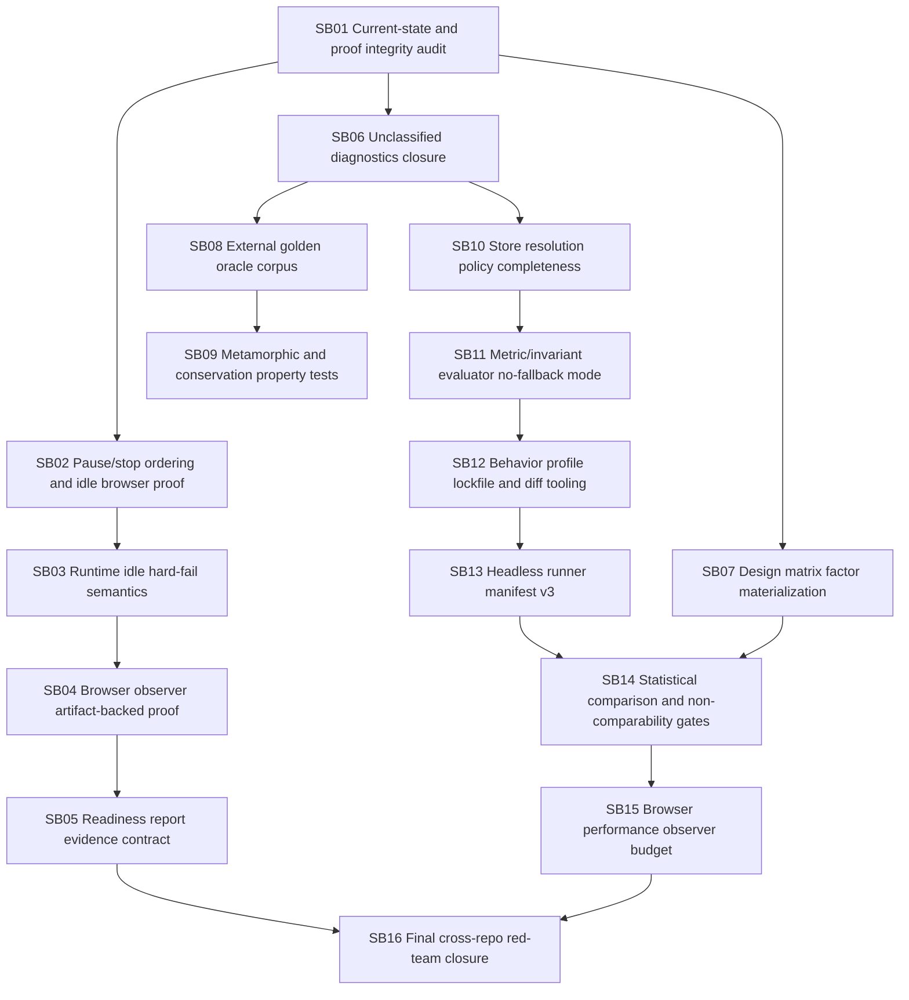

# CanDoItAll WebGL Engine + Economy Follow-up Hardening Bundle v8

Prepared date: 2026-06-04  
Stage: completed / closure validated  
Profile: initiative / post-v7 research-grade experiment hardening  
Target repositories:

- `fyziktom/CanDoItAll.Components` — target branch/ref: `webgl-engine`
- `fyziktom/CanDoItAll.Economy` — target branch/ref: `main`

## Purpose

The v7 implementation moved the stack from demo/smoke proof toward research-grade economic simulation tooling. This follow-up bundle verifies and hardens the remaining gaps that can still introduce technical noise into economic experiments.

The goal is not to add more demo visuals. The goal is to ensure that when an economic scenario fails, we can confidently distinguish:

1. a real economic-model failure,
2. an invalid scenario/input pack,
3. a simulator/runtime bug,
4. a metric/oracle mistake,
5. a browser observer issue,
6. or a non-comparable performance/configuration drift.

## Current review verdict

The current state is much stronger than earlier bundles:

- Components now exposes runtime stop and idle APIs.
- `RunPlayback` now attempts generation-based cancellation and runtime stop.
- Economy now has readiness reports, research policies, golden-oracle tests, scenario pack hashes, headless runner, design harness, and experiment-readiness documentation.

However, the stack still needs another hardening pass before research claims should rely on it. The strongest remaining concerns are:

- stop/pause ordering and proof quality in browser playback,
- idle timeout semantics that can silently remain a warning in some APIs,
- readiness reports that can still be marked research-ready by boolean flags rather than artifact-backed proof,
- design matrix factors that are recorded but not yet proven to mutate scenario inputs,
- lack of external data-driven golden oracle fixture corpus,
- incomplete classification of unrecognized diagnostics,
- and insufficient mutation/metamorphic testing for economic invariants.

## Critical instructions for Codex

- Work one subbundle at a time.
- Do not weaken strict/research-grade behavior to make tests pass.
- Do not claim research readiness from booleans alone; require artifact-backed proof.
- Do not use browser/WebGL as economic ground truth.
- Do not allow design matrix factors to be passive labels.
- Do not treat warning-only reports as research-ready.
- Do not close a subbundle unless its proof includes failing-first evidence or a concrete reason why failing-first is impossible.
- Large-screen proof is enough; do not spend time optimizing small/medium/mobile screens.
- Preserve WebGlLib as a generic visualization layer; keep economy semantics in Economy.

## Execution order summary



## Prepared-stage validation

Run from the bundle root:

```powershell
python scripts/validate_bundle.py --stage prepared --profile initiative
```

Expected result:

```text
Bundle validation passed for stage=prepared, profile=initiative, subbundles=16
```

## Execution validation

Execution artifacts now live under `proof/SB01` through `proof/SB16`, and the execution report is `reviews/01-execution-report.md`. Final closure passed `python scripts/validate_bundle.py --stage completed --profile initiative`.

## Completion definition

The bundle is complete only when Codex can produce a machine-readable final report stating:

- pause/stop does not leave active motions/stages/barriers,
- browser observer proof is artifact-backed and does not mutate economic truth,
- research-ready cannot be achieved without oracle/browser evidence artifacts,
- design matrix factor levels actually affect input configuration or are rejected as labels-only,
- every diagnostic is classified into scenario/simulation/metrics/projection/runtime/UI/oracle/performance,
- headless artifacts and reproducibility manifests are diffable,
- and golden-oracle plus metamorphic tests protect economic semantics from simulator noise.
