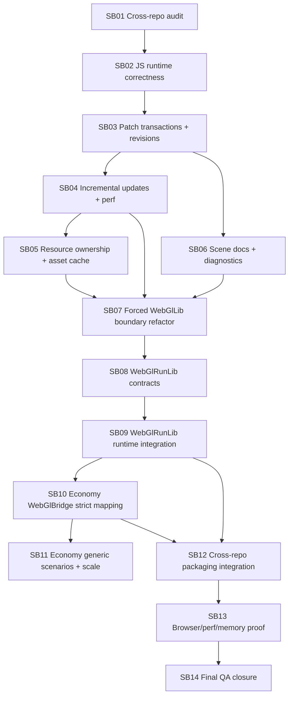

# CanDoItAll WebGL Engine + Economy Hardening Workflow Bundle

Prepared date: 2026-06-01  
Stage: completed
Profile: initiative / cross-repo architecture hardening  
Primary target repositories:

- `fyziktom/CanDoItAll.Components`, branch `webgl-engine`
- `fyziktom/CanDoItAll.Economy`, current working branch/main line

## Purpose

This bundle instructs Codex to harden the WebGL/3D visualization architecture across `CanDoItAll.Components` and `CanDoItAll.Economy`.

The required end state is a layered, generic, durable engine foundation:

```text
CanDoItAll.Components.WebGlLib
  ultra-light generic scene/model/asset/render/interactions substrate
  usable for simple model viewing and generic 3D visualizations

CanDoItAll.Components.WebGlRunLib
  generic run/playback/action/stage contracts over WebGlLib scene patches
  no Economy-specific or production-line-specific semantics

CanDoItAll.Economy.Simulation.WebGlBridge
  first real consumer that maps generic economy visual frames/actions to WebGlRunLib
  strict provenance and fallback policy
```

## Critical instructions for Codex

- Implement one subbundle at a time.
- Do not start a downstream subbundle until the previous progression gate passes.
- Do not put Economy, ledger, market, production-line, Vernon Smith, or domain-specific simulation concepts into `WebGlLib` or `WebGlRunLib`.
- Preserve the ultra-light `WebGlLib` use case: a simple app must be able to display a 3D model/scene without referencing `WebGlRunLib`.
- Treat all critical subbundles as semantic proof work, not as structure-only refactoring.
- Every critical subbundle must create `proof/SBxx/manifest.md` and `proof/SBxx/semantic-invariants.md`.
- Every phase has a mandatory refactor checkpoint before downstream work continues.
- Browser proof must include console logs, screenshots where visual behavior changed, diagnostics JSON, and explicit review questions.
- Package/reference proof must cover local project-reference mode and package-consumption mode where possible.

## Bundle structure

- `inputs/` preserves raw request and source references.
- `analysis/` records current state, risks, reopen triggers and QA concerns.
- `requirements/` normalizes the hardening requirements.
- `architecture/` defines the target layers and boundary rules.
- `plan/` contains the dependency map and phase gates.
- `subbundles/` contains implementation-ready phases.
- `templates/` contains proof, invariant, and refactor-gate templates.
- `traceability/` maps requirements, source observations and subbundles.
- `shared-prompts/` contains reusable prompts for Codex and QA.
- `reviews/` contains preparation QA review and execution report skeleton.
- `evidence/` contains source summaries prepared during bundle creation.
- `scripts/` contains a local structural validator for this bundle.

## Execution order summary



## Prepared-stage validation

From the bundle root, run:

```powershell
python scripts/validate_bundle.py --stage prepared --profile initiative
```

The script checks required root sections, subbundle README sections, dependency-map sections, traceability files, XLSX presence, and critical proof placeholders.

## Companion XLSX

Open `CanDoItAll_WebGlEngine_Economy_Hardening_Checklists.xlsx` for sortable requirements, source references, subbundle checklist, QA gates, risks, and test matrix.

## Preparation QA status

Prepared validation passed locally:

```text
Bundle validation passed for stage=prepared, profile=initiative, subbundles=14
```

Final preparation inspection is stored in `reviews/02-senior-qa-inspector-final-check.md`.

## Execution progress

SB01 is completed. Current repo refs, source hashes, baseline command transcripts, CodeAnalytics snapshots, and the SB01 refactor gate are stored under `proof/SB01/`. Components build/test and Economy build/WebGl+Simulation filtered tests pass; Economy warning context is preserved for downstream package and bridge phases.

SB02 is completed. `resolveObjectPosition` is now imported by the scene graph runtime, `tools/webgllib/audit-scene-runtime-imports.cjs` is wired through npm and WebGlLib docs, and `/tycoon-village` browser proof covers create, real drag, transform-only patch, diagnostics, screenshot, and dispose. Evidence is stored under `proof/SB02/`.

SB03 is completed. `WebGlSceneModel.Revision` is the canonical scene revision, C# and JS patches preflight structural failures before mutation, object removal cleans links/layers, and scene content hashing ignores UI-only revision while retaining canonical scene revision. Evidence is stored under `proof/SB03/`.

SB04 is completed. Incremental patch classification now prevents transform-only, symbol-only, and link-only runtime patches from triggering full scene rebuilds, and browser stress proof covers 250 objects plus 100 transform patches with diagnostics deltas. Evidence is stored under `proof/SB04/`.

SB05 is completed. Resource ownership now separates geometry, material, and texture disposal, cloned tinted GLB materials retain shared template textures, and state-local asset cache disposal releases cached template resources with browser proof over a textured GLB. Evidence is stored under `proof/SB05/`.

SB06 is completed. Document and live scene validation now share generic scene checks, layer duplicate/stale membership is diagnosed against scene objects as the canonical source, JS diagnostics parity has no missing C# runtime fields, and public docs include WebGlRunLib in the package map. Evidence is stored under `proof/SB06/`.

SB07 is completed. WebGlLib boundary proof now has a reusable static audit, adversarial forbidden-reference probe, WebGlLib-only viewer sample, updated dependency-direction docs, and a boundary audit report. Evidence is stored under `proof/SB07/`.

SB08 is completed. WebGlRunLib now has documented generic run contracts, public document and action-plan validators, compile parity coverage for barriers/parallel/direct patches, and a reusable WebGlRunLib boundary audit. Evidence is stored under `proof/SB08/`.

SB09 is completed. WebGlRunLib runtime integration now executes generic run frames through `WebGlRunDocumentRunner` and `WebGlRunBrowserApplyAdapter` into `WebGlSceneView` public command-batch APIs, and `/run-playback` browser proof shows a 24-stage/24-motion generic batch frame with `interopCallsAvoided=23`. Evidence is stored under `proof/SB09/`.

SB10 is completed. Economy WebGlBridge now stamps and validates command-level source provenance for generated motions and scene patches, strict mapping tests cover default failure modes and explicit diagnostics, and project/package reference bridge builds pass using a local proof feed. Evidence is stored under `proof/SB10/`.

SB11 is completed. Economy generic scenario proof now projects a large shared-resource scenario through visual frames into strict WebGlRun documents, validates 15,000 stages and 10,000 motions, records deterministic replay fingerprint proof, inventories the current scenario examples/experiment fixtures, and preserves an explicit browser-host gap instead of claiming unavailable UI playback. Evidence is stored under `proof/SB11/`.

SB12 is completed. Components release packaging now produces WebGlLib/WebGlRunLib packages under `artifacts/packages`, Economy WebGlBridge builds in both explicit local project-reference mode and package-consumption mode, stale package-feed failure is captured with an isolated proof NuGet.config mitigation, and boundary audits still pass with no Economy references in Components. Evidence is stored under `proof/SB12/`.

SB13 is completed. Browser proof now covers WebGlSandbox `/tycoon-village`, `/run-playback`, `/performance-proof`, and Economy Node `/economy/simulation-sandbox`; the performance proof exposed and fixed oversized Blazor command-result event callbacks by compacting callback payloads while preserving rich direct interop results. Focused Components, WebGlRunLib, resource ownership, boundary, command-batch parity, and Economy probe tests pass. Evidence is stored under `proof/SB13/`.

SB14 is completed. Final requirement closure, senior QA, C# Blazor architecture, vanilla JS runtime and manager reviews are stored under `reviews/`; completed-stage validation passes and all normalized requirements are closed for the prepared bundle scope. Evidence is stored under `proof/SB14/`.
