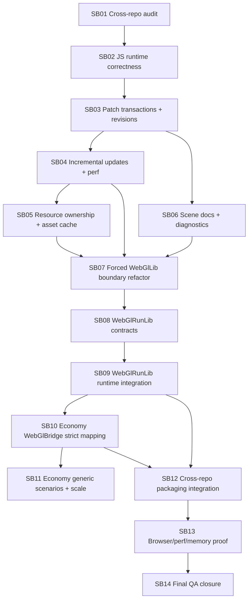

# CanDoItAll WebGL Engine + Economy Hardening Workflow Bundle

Prepared date: 2026-06-01  
Stage: prepared  
Profile: initiative / cross-repo architecture hardening  
Primary target repositories:

- `fyziktom/CanDoItAll.Components`, branch `webgl-engine`
- `fyziktom/CanDoItAll.Economy`, current working branch/main line

## Purpose

This bundle instructs Codex to harden the WebGL/3D visualization architecture across `CanDoItAll.Components` and `CanDoItAll.Economy`.

The required end state is a layered, generic, durable engine foundation:

```text
CanDoItAll.Components.WebGlLib
  ultra-light generic scene/model/asset/render/interactions substrate
  usable for simple model viewing and generic 3D visualizations

CanDoItAll.Components.WebGlRunLib
  generic run/playback/action/stage contracts over WebGlLib scene patches
  no Economy-specific or production-line-specific semantics

CanDoItAll.Economy.Simulation.WebGlBridge
  first real consumer that maps generic economy visual frames/actions to WebGlRunLib
  strict provenance and fallback policy
```

## Critical instructions for Codex

- Implement one subbundle at a time.
- Do not start a downstream subbundle until the previous progression gate passes.
- Do not put Economy, ledger, market, production-line, Vernon Smith, or domain-specific simulation concepts into `WebGlLib` or `WebGlRunLib`.
- Preserve the ultra-light `WebGlLib` use case: a simple app must be able to display a 3D model/scene without referencing `WebGlRunLib`.
- Treat all critical subbundles as semantic proof work, not as structure-only refactoring.
- Every critical subbundle must create `proof/SBxx/manifest.md` and `proof/SBxx/semantic-invariants.md`.
- Every phase has a mandatory refactor checkpoint before downstream work continues.
- Browser proof must include console logs, screenshots where visual behavior changed, diagnostics JSON, and explicit review questions.
- Package/reference proof must cover local project-reference mode and package-consumption mode where possible.

## Bundle structure

- `inputs/` preserves raw request and source references.
- `analysis/` records current state, risks, reopen triggers and QA concerns.
- `requirements/` normalizes the hardening requirements.
- `architecture/` defines the target layers and boundary rules.
- `plan/` contains the dependency map and phase gates.
- `subbundles/` contains implementation-ready phases.
- `templates/` contains proof, invariant, and refactor-gate templates.
- `traceability/` maps requirements, source observations and subbundles.
- `shared-prompts/` contains reusable prompts for Codex and QA.
- `reviews/` contains preparation QA review and execution report skeleton.
- `evidence/` contains source summaries prepared during bundle creation.
- `scripts/` contains a local structural validator for this bundle.

## Execution order summary



## Prepared-stage validation

From the bundle root, run:

```powershell
python scripts/validate_bundle.py --stage prepared --profile initiative
```

The script checks required root sections, subbundle README sections, dependency-map sections, traceability files, XLSX presence, and critical proof placeholders.

## Companion XLSX

Open `CanDoItAll_WebGlEngine_Economy_Hardening_Checklists.xlsx` for sortable requirements, source references, subbundle checklist, QA gates, risks, and test matrix.

## Preparation QA status

Prepared validation passed locally:

```text
Bundle validation passed for stage=prepared, profile=initiative, subbundles=14
```

Final preparation inspection is stored in `reviews/02-senior-qa-inspector-final-check.md`.
