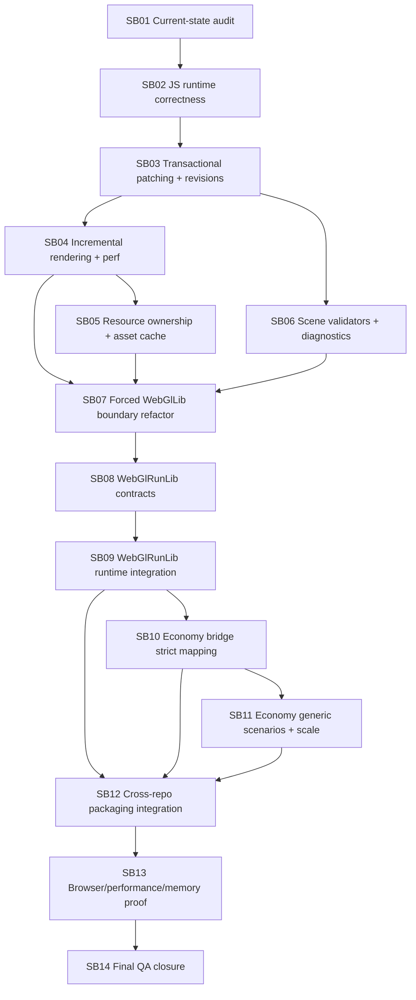

# Phase Plan

Prepared date: 2026-06-01

## Subbundle Dependency Map

## Critical Subbundles

Critical foundation subbundles:

- SB01: current-state audit controls all later assumptions.
- SB02: JS runtime correctness controls browser trust.
- SB03: patch transactions and revision policy control state correctness.
- SB04: incremental update proof controls large-simulation performance.
- SB05: resource ownership controls GLB lifecycle safety.
- SB07: WebGlLib boundary refactor controls layering.
- SB08: WebGlRunLib generic contracts control future simulator reuse.
- SB09: run integration controls browser playback path.
- SB10: Economy strict mapping controls first real consumer correctness.
- SB12: package/reference integration controls cross-repo usability.
- SB13: final browser/perf/memory proof controls release confidence.
- SB14: final QA closure controls completion.

## Phase Gates

| Gate | After | Blocking condition | Required proof |
| --- | --- | --- | --- |
| Gate A | SB01 | Current source state unknown | Current-state report, hashes, baseline commands |
| Gate B | SB02 | JS module audit absent or browser console errors | Static audit + browser smoke |
| Gate C | SB03 | Failed patch can mutate state | Negative patch no-mutation proof |
| Gate D | SB04 | Transform-only patch rebuilds scene | Diagnostics prove no full rebuild |
| Gate E | SB05 | Shared texture disposal risk remains | Multi-instance GLB lifecycle proof |
| Gate F | SB07 | WebGlLib contains run/domain semantics | Boundary audit and dependency scan |
| Gate G | SB08 | WebGlRunLib overfits Economy | Generic non-economy fixture and domain-leak scan |
| Gate H | SB10 | Economy fallback hides invalid mapping | Strict negative tests and provenance positive proof |
| Gate I | SB12 | Package/project-ref mode unproven | Build/pack/reference transcripts |
| Gate J | SB13 | Browser/performance proof shallow | Artifact-backed browser, stress and red-team proof |
| Gate K | SB14 | Traceability or proof missing | Final validator and closure matrix |

## Mandatory Refactor Pass Rule

Every subbundle must perform a local refactor pass before closure:

1. Review every touched source file.
2. Remove duplicate logic introduced during the subbundle.
3. Remove fixture-specific branches, stubs, TODO production paths and shallow adapters.
4. Check whether any code belongs in a lower or higher layer.
5. Update tests and docs affected by the refactor.
6. Record the result in the subbundle proof manifest.

Dedicated hard refactor gates are SB07, SB09 and SB12.
