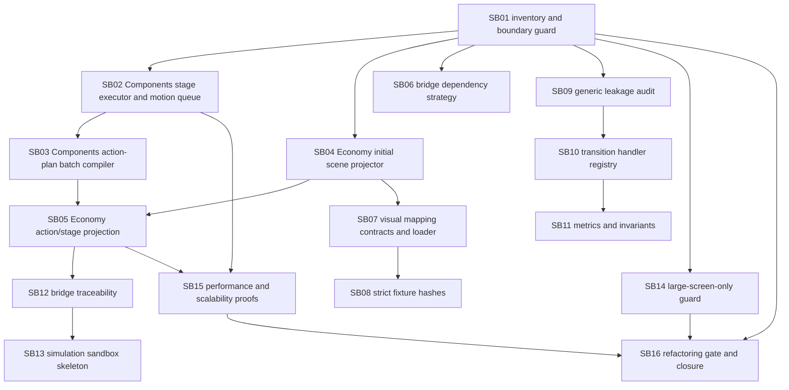

# Phase plan

## Dependency map

## Critical foundations

- SB01 is critical because later work depends on repo branch and dependency boundaries.
- SB02 and SB03 are critical because Economy projection depends on generic staged WebGL playback semantics.
- SB04, SB05, SB07, SB08, and SB12 are critical because they convert simulation/visualization state into actionable WebGL run documents without hardcoded example logic.
- SB09, SB14, and SB16 are critical closure gates for genericity, scope discipline, and proof quality.

## Progression gates

- Do not start Economy bridge projection until Components staged batch semantics have source and test proof.
- Do not close bridge projection while frames contain metadata-only stages or duplicate global actions.
- Do not close strict input pack work until committed shared-well and farmer-land fixtures pass strict hash validation.
- Do not close final bundle while boundary audits, targeted tests, and proof manifests are stale or missing.
