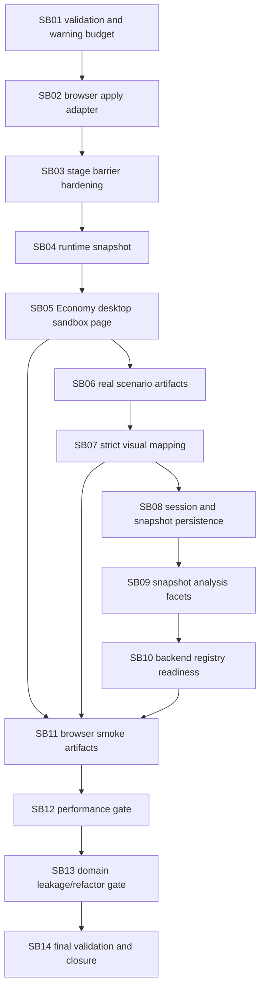

# Phase Plan

## Execution Order

1. SB01 - Cross-repo validation and warning budget.
2. SB02 - Components generic browser apply adapter.
3. SB03 - Components stage barrier hardening.
4. SB04 - Components runtime snapshot for browser state.
5. SB05 - Economy desktop sandbox page skeleton.
6. SB06 - Economy real scenario artifact runner hardening.
7. SB07 - Economy strict visual mapping completion.
8. SB08 - Economy session persistence and snapshot store wiring.
9. SB09 - Economy snapshot analysis facets.
10. SB10 - Economy backend registry and ledger readiness probe.
11. SB11 - Economy browser smoke artifacts.
12. SB12 - Performance and scalability gate.
13. SB13 - Domain leakage and refactoring gate.
14. SB14 - Final validation and closure.

## Subbundle Dependency Map

## Critical Subbundles

- SB01 is critical because warning/boundary drift can invalidate all later proof.
- SB02, SB03, and SB04 are critical Components foundations for browser execution and runtime state capture.
- SB05 and SB11 are critical UI/browser proof phases.
- SB06 and SB07 are critical because overclaiming readiness or hiding fallback would make the browser smoke misleading.
- SB14 is critical for final fake-proof resistance and closure.

## Phase Gates

- SB01 gate: branch/status, warning budget, and focused warning commands are recorded.
- SB02 gate: fake runtime proves initial scene reset, patches, motions, command stages, barriers, counts, and diagnostics.
- SB03 gate: stage barriers and bounded journal diagnostics cover two-stage same-object sequencing and unknown policy behavior.
- SB04 gate: generic bounded runtime snapshot carries browser state needed by Economy snapshots.
- SB05 gate: desktop sandbox page can load fixture, apply at least one frame, pause, step, seek, snapshot, and analyze.
- SB06 gate: real scenario artifacts are deterministic where canonical, readiness wording separates headless from browser smoke, and temp output is controlled.
- SB07 gate: at least one probe runs strict with no fallback object and no no-op pose/symbol fallback.
- SB08 gate: session export/import roundtrip validates experiment path, input hash, step, snapshot hash, and snapshot listing.
- SB09 gate: shared-resource and finite-resource snapshots produce generic analysis facets.
- SB10 gate: fake, missing, and ledger-descriptor backend cases are deterministic and tested.
- SB11 gate: desktop browser smoke artifacts exist or an explicit browser-host blocker is recorded after page proof attempts.
- SB12 gate: performance metrics and threshold warnings are recorded for moderate desktop sizes.
- SB13 gate: generic layers pass forbidden term and file-size scans or have concrete split follow-ups.
- SB14 gate: final commands, transcripts, manifests, raw-note closure, browser analytics, and completed validator agree.
