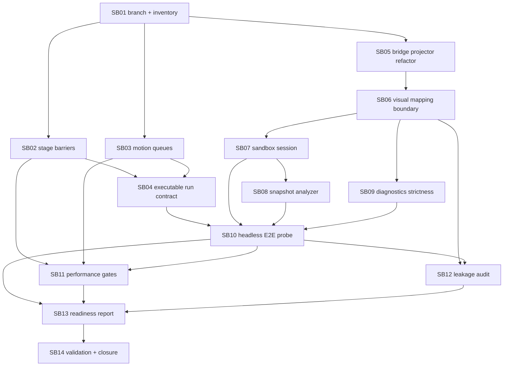

# Phase Plan

## Execution Order

| Order | Subbundle | Status | Depends on | Notes |
|---:|---|---|---|---|
| 1 | SB01 | Prepared | None | Establish branch guard, project inventory, and boundary baseline. |
| 2 | SB02 | Prepared | SB01 | Stage barrier runtime proof in Components JS. |
| 3 | SB03 | Prepared | SB01 | Motion queue semantics in Components JS. |
| 4 | SB04 | Prepared | SB02, SB03 | Generic executable run document contract in Components C#. |
| 5 | SB05 | Prepared | SB01 | Economy projector split/behavior parity. |
| 6 | SB06 | Prepared | SB01, SB05 | Renderer-neutral visual mapping boundary. |
| 7 | SB07 | Prepared | SB05, SB06 | Economy sandbox session API. |
| 8 | SB08 | Prepared | SB07 | Snapshot builder/analyzer/diff/store hardening. |
| 9 | SB09 | Prepared | SB05, SB06 | Strict bridge diagnostics. |
| 10 | SB10 | Prepared | SB04, SB07, SB08, SB09 | End-to-end headless executable probes. |
| 11 | SB11 | Prepared | SB02, SB03, SB10 | Performance/scalability gates. |
| 12 | SB12 | Prepared | SB06, SB10 | Domain leakage and genericity audit. |
| 13 | SB13 | Prepared | SB10, SB11, SB12 | Readiness report for next demo bundle. |
| 14 | SB14 | Prepared | SB01-SB13 | Final validation and closure. |

## Subbundle Dependency Map

## Critical Subbundles

Critical foundations requiring artifact-backed manifest and semantic invariants before closure:

- SB02 - stage barrier behavior can create false-positive executable proof.
- SB03 - motion queue semantics gate runtime determinism.
- SB04 - generic executable run document contract unlocks the Economy chain.
- SB06 - renderer leakage would violate repository boundaries.
- SB07 - session semantics unlock snapshot and E2E probes.
- SB08 - snapshot analysis must be production service behavior, not test-only logic.
- SB09 - strict diagnostics prevent broken visuals from silently passing.
- SB10 - full headless chain is the central readiness proof.
- SB11 - performance gates prevent hidden scalability regressions.
- SB12 - genericity audit protects reusable libraries.
- SB14 - final closure must reject fake or incomplete proof.

Support subbundles still require manifests and transcripts, but semantic invariants are optional unless behavior changes require them.

## Phase Gates

- Entry gate: prerequisites listed in this plan are completed or explicitly blocked, and branch/boundary guard from SB01 remains true.
- Closure gate: subbundle acceptance checklist is proven by transcripts under `proof/SBxx/`, status rows in `reviews/01-execution-report.md`, and source assertions where required.
- Dependency reopen gate: any later failing test, audit, or boundary violation reopens the earliest owning subbundle before downstream closure.
- Final gate: `scripts/validate_bundle.py --stage completed`, all SB14 required commands, and note-by-note closure must pass.
