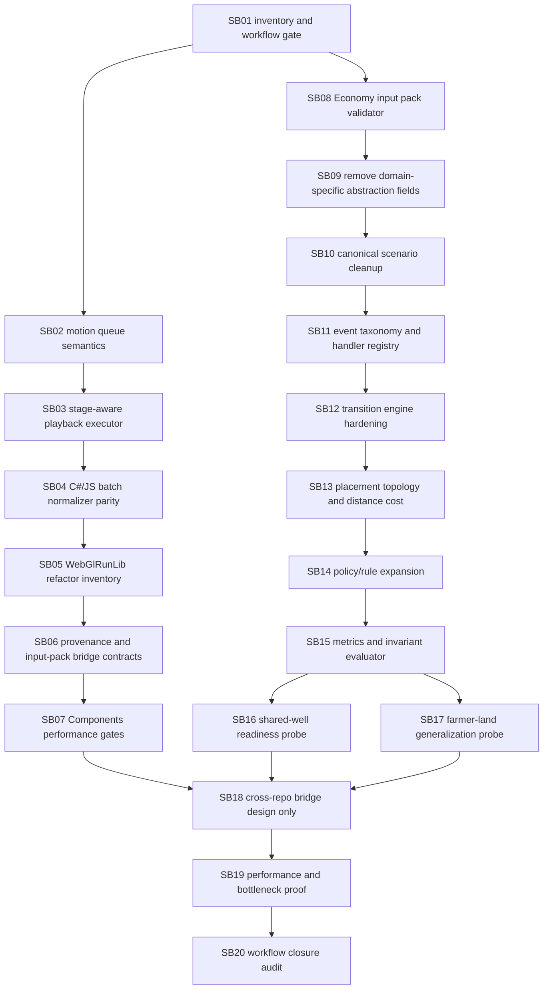

# Phase plan

## Subbundle Dependency Map

## Critical Subbundles

All subbundles are marked critical because they either protect domain-neutral WebGL ordering, deterministic experiment input discipline, generic Economy simulation semantics, or final proof integrity. SB02, SB03, SB08, SB09, SB12, SB15, SB16, SB17, and SB20 are critical foundations with semantic positive and adversarial negative proof requirements.

## Phase Gates

- SB01 must record current branches, dirty files, and the repaired bundle readiness gate before feature code changes.
- Components subbundles SB02-SB07 must not introduce Economy references or non-desktop WebGL work.
- Economy subbundles SB08-SB17 must not introduce Components/WebGL references and must keep simulation input-driven.
- SB18 is design-only; no direct cross-repo project references may be added.
- SB19 must include performance proof for batch normalization and deterministic simulation surfaces.
- SB20 must close raw findings one by one as Solved, Partially solved, or Not solved and rerun completed-stage validation.
