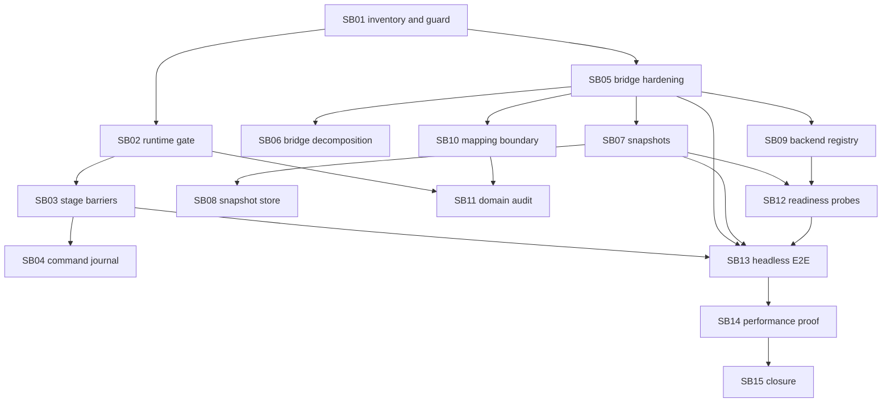

# Phase Plan

## Execution Order

| Order | Subbundle | Purpose | Status |
|---:|---|---|---|
| 1 | SB01 | Cross-repo inventory and boundary guard | Completed |
| 2 | SB02 | Components JS runtime refactor gate | Completed |
| 3 | SB03 | Components stage barriers and motion queue hardening | Completed |
| 4 | SB04 | Components command journal and replay proof | Completed |
| 5 | SB05 | Economy WebGL bridge projection hardening | Completed |
| 6 | SB06 | Economy bridge projector decomposition | Completed |
| 7 | SB07 | Snapshot builder, analyzer and diff hardening | Completed |
| 8 | SB08 | File-based snapshot store | Completed |
| 9 | SB09 | Backend-neutral Economy SimulationSandbox | Completed |
| 10 | SB10 | Visual mapping contract boundary | Completed |
| 11 | SB11 | Domain leakage audit | Completed |
| 12 | SB12 | Generic readiness probes | Completed |
| 13 | SB13 | Headless bridge end-to-end proof | Completed |
| 14 | SB14 | Performance and scalability proofs | Completed |
| 15 | SB15 | Workflow closure | Completed |

## Subbundle Dependency Map

## Critical Subbundles

Critical foundations: SB03, SB04, SB05, SB06, SB07, SB08, SB09, SB10, SB12, SB13, SB14, and SB15.

Supporting gates: SB01, SB02, and SB11.

## Phase Gates

- SB01 must pass branch, dirty-state, Components runtime audit, Economy boundary audit, and reference checks before feature implementation.
- SB02 must keep runtime JS below hard thresholds and preserve large-screen-only policy before SB03/SB04.
- SB03 must prove barrier semantics and object motion queue ordering before SB04/SB13.
- SB04 must prove delayed stage journal visibility before SB13.
- SB05 must prove strict bridge mapping before SB06/SB10/SB13.
- SB07 and SB08 must prove reusable snapshot creation, analysis, diffing, hashing, storage, and reload before SB13.
- SB09 must prove backend-neutral sandbox orchestration before SB12/SB13.
- SB11 must pass forbidden-domain audits before final closure.
- SB13 must prove the joined headless pipeline before SB14.
- SB14 must produce thresholded performance evidence before SB15.
- SB15 must pass completed validator and fake-proof resistance review before bundle closure.
