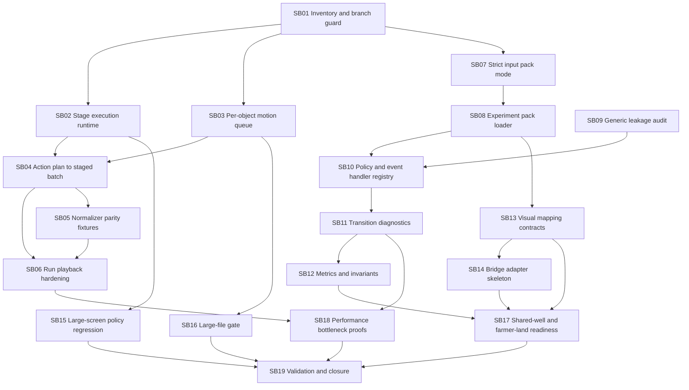

# Phase Plan

## Subbundle Dependency Map

## Critical Subbundles

All subbundles are treated as critical because this bundle is explicitly about bridge readiness and hardening foundations. The highest-risk critical foundations are:

| Subbundle | Why it is critical |
|---|---|
| SB02 | Later staged playback, run playback, and bridge projection depend on real stage barriers. |
| SB03 | Later sequential visual actions depend on motions not fighting each other. |
| SB07 | Loader, readiness, and deterministic experiment proof depend on strict input integrity. |
| SB08 | Readiness probes and bridge inputs depend on one high-level loading path. |
| SB10 | Genericity depends on policies and handlers being plugin-friendly rather than core special cases. |
| SB11 | Downstream metrics and readiness proof depend on trustworthy diagnostics. |
| SB12 | Final readiness must interpret results with generic metrics and invariants. |
| SB14 | The bridge boundary must be isolated before any final demo work. |
| SB17 | Confirms both example probes use the same generic path. |
| SB19 | Closes proof consistency and final validation. |

## Phase Gates

| Gate | Required pass condition |
|---|---|
| Prepared gate | `scripts/validate_bundle.py --stage prepared` passes and no required bundle scaffold is missing. |
| Entry gate | Current subbundle prerequisites are completed or explicitly N/A, source references still exist, and scope still matches the bundle. |
| Closure gate | Acceptance checklist, proof artifacts, transcripts, changed-file hashes, source assertions, semantic invariants, and execution-report rows are updated. |
| Cross-repo bridge gate | Components has no Economy references; low-level Economy abstractions have no WebGL/Components references; only the bridge project may reference both. |
| Large-screen gate | WebGL work has no unguarded small/medium/mobile/tablet optimization drift. |
| Final gate | Components tests/audits, Economy tests/audits, cross-repo scans, readiness artifacts, performance notes, and `scripts/validate_bundle.py --stage completed` pass or record an honest blocker. |

