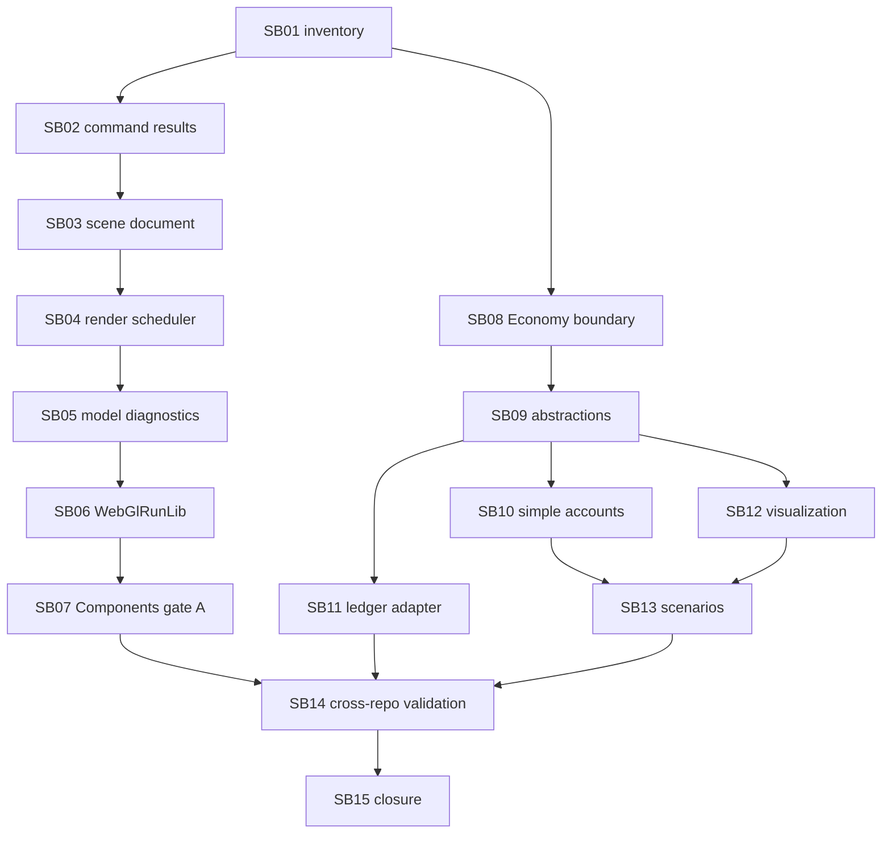

# Phase Plan

## Execution Order

- SB01: current branch and inventory guard.
- SB02: Components JS command-result hardening.
- SB03: Components scene document hashing and validation.
- SB04: Components render scheduler and resource disposal hardening.
- SB05: Components model diagnostics batch report.
- SB06: Components WebGlRunLib foundation.
- SB07: Components refactoring gate A.
- SB08: Economy inventory and boundary guard.
- SB09: Economy shared simulation abstractions.
- SB10: Economy simple-account backend preparation.
- SB11: Economy ledger-backed simulation adapter preparation.
- SB12: Economy visualization contracts without WebGL dependency.
- SB13: Economy scenario seeds.
- SB14: cross-repo no-coupling validation.
- SB15: refactoring gate B and closure.

## Subbundle Dependency Map

## Critical Subbundles

- SB01 is critical because branch and inventory evidence protect the execution baseline.
- SB14 is critical because it consolidates the cross-repo build, test, screenshot, and no-coupling evidence for subbundles 02 through 13.
- SB15 is critical because it closes the reports, proof manifests, and validator handoff.

## Phase Gates

- Do not start dependent work until listed prerequisites are completed or explicitly reopened.
- Run required builds, tests, audits, dependency scans, and browser screenshots before final closure.
- Reopen the owning subbundle if source evidence contradicts a boundary, render, hash, or deterministic-output claim.
