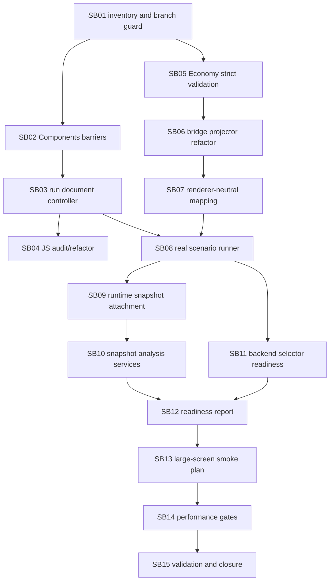

# Phase Plan

## Execution Order

1. SB01 - Cross-repo inventory and branch guard.
2. SB02 - Components runtime stage barrier hardening.
3. SB03 - Components executable run document controller.
4. SB04 - Components JS runtime size/refactor gate.
5. SB05 - Economy bridge strict execution validation.
6. SB06 - Economy bridge projector refactoring.
7. SB07 - Economy visual mapping generic schema.
8. SB08 - Economy simulation sandbox real test runner.
9. SB09 - Economy snapshot runtime state attachment.
10. SB10 - Economy snapshot analysis service hardening.
11. SB11 - Backend selector and ledger readiness.
12. SB12 - Real scenario readiness probe.
13. SB13 - Large-screen browser smoke plan.
14. SB14 - Performance and scalability gates.
15. SB15 - Validation and closure.

## Subbundle Dependency Map

## Critical Subbundles

- SB01 is a critical guard because it prevents branch drift and dependency-boundary mistakes.
- SB02 and SB03 are critical foundations for executable playback.
- SB05 is critical because strict bridge validation prevents invalid WebGL run documents from passing silently.
- SB08, SB09, and SB12 are critical for real-scenario readiness evidence.
- SB14 is critical for performance confidence before browser smoke expansion.
- SB15 is critical for final proof coherence and raw-note closure.

## Phase Gates

- SB01 gate: both repository branch/commit baselines and boundary scans are recorded.
- SB02 gate: barrier, cancellation, event, render-idle, and journal semantics have tests or audit proof.
- SB03 gate: generic run document controller can report stage/action ids and export runtime snapshot data.
- SB04 gate: scene runtime audit passes thresholds and domain leakage checks.
- SB05 gate: strict validator reports structured failures for all listed invalid bridge inputs.
- SB06 gate: projectors are separated and diagnostics aggregation has focused tests.
- SB07 gate: renderer-neutral boundaries pass source and project reference scans.
- SB08 gate: required real scenario artifacts are generated for shared-resource and finite-resource probes.
- SB09 gate: snapshot runtime attachment is serialized, analyzed, and separately hashed.
- SB10 gate: reusable analyzers cover required pressure categories without domain hard-coding.
- SB11 gate: backend selection and ledger-readiness diagnostics are deterministic and tested.
- SB12 gate: readiness report answers every required question with artifact-backed evidence.
- SB13 gate: large-screen smoke criteria are ready without mobile/tablet scope creep.
- SB14 gate: performance probes emit actual counts, elapsed times, thresholds, and bounded queue/journal evidence.
- SB15 gate: required commands pass, transcripts are non-empty, proof manifests exist, and final validator passes.
