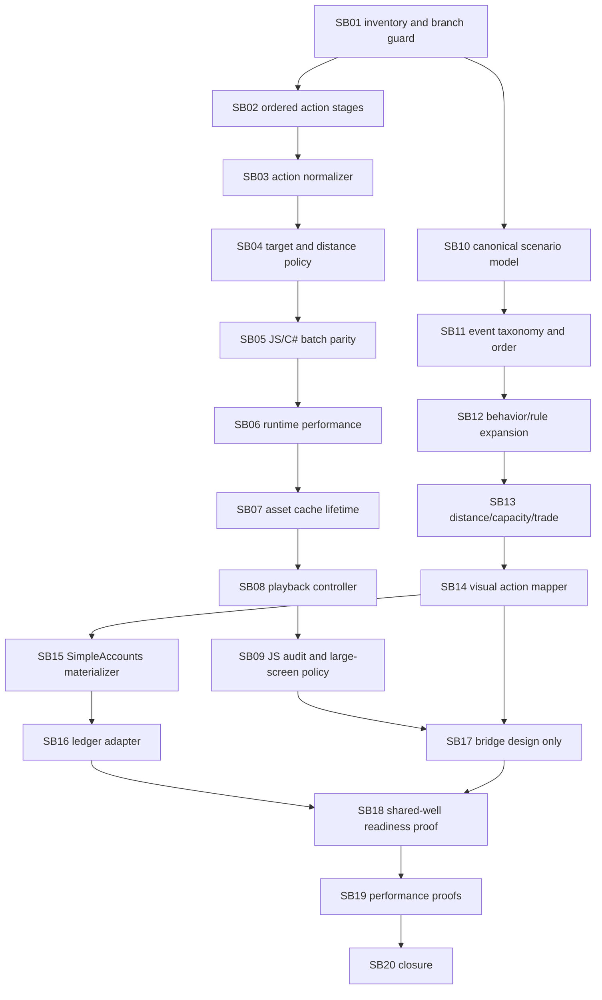

# WebGL + Economy Shared-Well Hardening Phase Plan

Hard rules:

- Work in the branch already checked out in each repository.
- Keep Components generic and independent from Economy.
- Keep Economy independent from Components/WebGL.
- Validate WebGL only on desktop/large-screen viewports, 1440x900 or larger.

## Dependency Map

## Critical Foundations

- SB02 is critical for preserving sequential visual meaning across WebGL run frames.
- SB03 is critical for avoiding alias drift in Components action processing.
- SB05 is critical for browser/runtime parity with C# batch normalization.
- SB10 and SB11 are critical for canonical Economy semantics.
- SB12 through SB14 are critical for the shared-resource scenario proof.
- SB18 and SB19 are critical closure proofs.

## Progression Gates

- Components implementation must not start until SB01 inventory confirms the branch and clean starting state.
- Components downstream subbundles must re-check SB02/SB03/SB05 if ordered action proof weakens.
- Economy downstream subbundles must re-check SB10/SB11 if canonicalization or ordering proof weakens.
- SB17 is documentation-only and must not introduce cross-repo references.
- SB18 must include no-coupling proof and explicit shared-well readiness status.
- SB19 must include desktop-only WebGL screenshots or browser artifacts for rendered scene/model proof.

