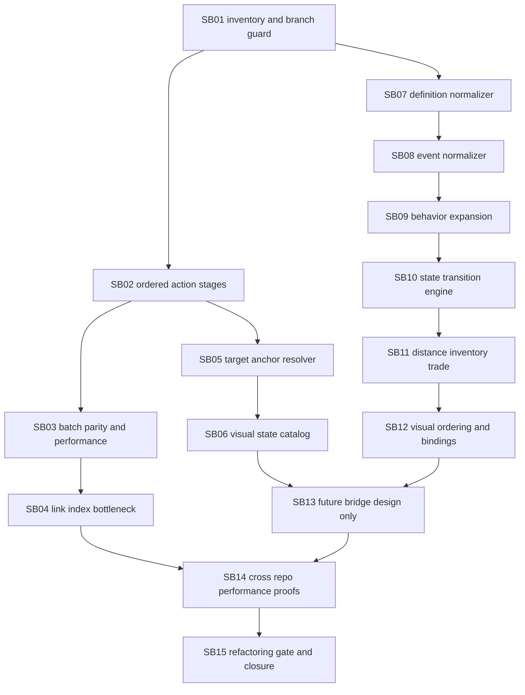

# Phase Plan

## Dependency Map

## Critical Foundations

- SB02, SB03, SB04, SB05 and SB06 are Components foundations for ordered generic WebGL run execution.
- SB07, SB08, SB09, SB10, SB11 and SB12 are Economy foundations for canonical scenario, event, frame and visual action readiness.
- SB14 is the cross-repo proof gate.
- SB15 is the final refactoring and scope closure gate.

## Phase Gates

- Do not start a dependent subbundle until its prerequisites are completed or explicitly blocked.
- Do not connect Economy projects to Components or WebGL projects in this wave.
- Do not add economy, water, well, ledger, tax or business-specific concepts to Components WebGlLib or WebGlRunLib.
- Use 1440x900 or larger for any WebGL/browser proof. Small, medium, mobile and tablet proof is out of scope.
- Every completed subbundle must have a proof manifest under `proof/SBxx/manifest.md`.
