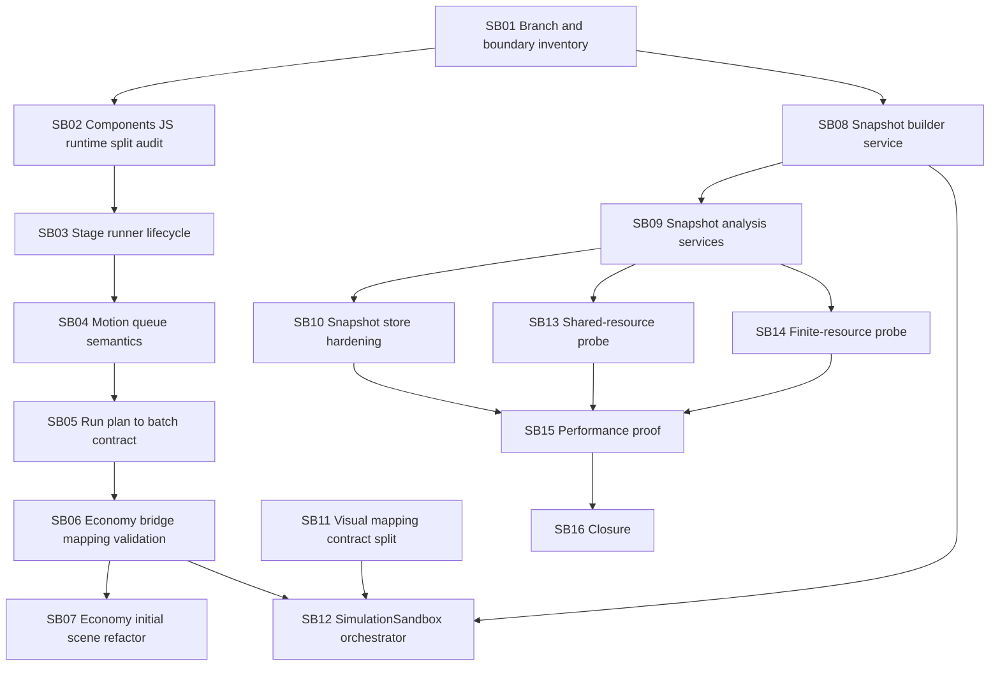

# Phase Plan

## Execution Order

Execute subbundles in numeric order unless a gate reopens a prerequisite.

## Subbundle Dependency Map

## Critical Subbundles

| Subbundle | Critical foundation reason |
|---|---|
| SB03 | Stage barriers and diagnostics are the runtime foundation for ordered visual sequences. |
| SB04 | Motion queue semantics prevent misleading object movement proof. |
| SB05 | Batch compilation is the generic bridge from run actions to executable runtime commands. |
| SB06 | Mapping validation prevents silent or misleading Economy bridge output. |
| SB08 | Snapshot builder services are the reusable data-state foundation. |
| SB09 | Snapshot analysis is the reusable user-facing explanation foundation. |
| SB10 | Snapshot store hardening protects export/import and tamper detection. |
| SB12 | Backend-neutral orchestration is required before a final connected sandbox UI. |
| SB13 | Shared-resource probe proves generic capabilities without embedding example vocabulary. |
| SB14 | Finite-resource probe proves generic concentration behavior without embedding example vocabulary. |
| SB15 | Performance proof protects downstream UI work from hidden bottlenecks. |

## Phase Gates

| Gate | Required pass condition |
|---|---|
| Prepared gate | `scripts/validate_bundle.py --stage prepared` passes and bundle repair notes are durable. |
| Entry gate | Current subbundle prerequisites are complete, source references exist, and owned raw notes still match implementation scope. |
| Closure gate | Acceptance checklist, proof manifest, semantic invariants when critical, transcripts, source assertions, and execution report rows are updated. |
| Boundary gate | Components has no Economy references; Economy bridge/sandbox are the only Components/WebGL consumers. |
| Genericity gate | Generic code contains no forbidden probe terms except in tests, fixtures, probes, or docs. |
| Large-screen gate | WebGL work remains desktop / large-screen only. |
| Final gate | Components and Economy validation commands pass or explicit blockers are recorded; raw notes close as Solved, Partially solved, or Not solved; completed validator passes. |

