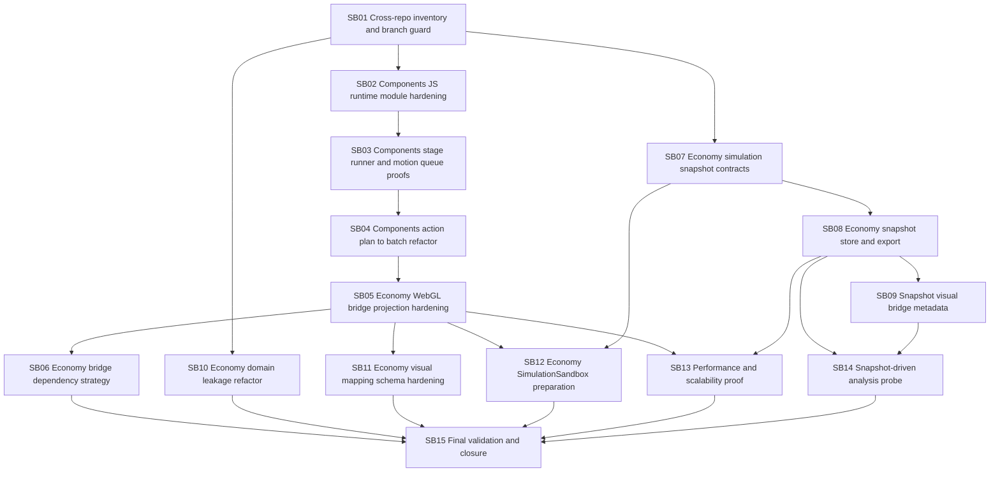

# Phase Plan

## Subbundle Dependency Map

## Critical Subbundles

| Subbundle | Critical foundation reason |
|---|---|
| SB02 | JS runtime maintainability and scheduler state are prerequisites for trustworthy stage playback. |
| SB03 | Staged playback and motion queue semantics unlock bridge-driven visual sequences. |
| SB05 | Bridge projection is the cross-repo path from Economy visual frames to executable WebGL run documents. |
| SB07 | Snapshot contracts are the canonical pause/inspect data model. |
| SB08 | Snapshot store/export is required for pause/export/analyze workflow proof. |
| SB10 | Genericity proof protects Components and Economy foundations from example overfitting. |
| SB13 | Performance proof prevents demo work from building on obvious bottlenecks. |
| SB14 | Snapshot-driven analysis proves the user-facing workflow the bundle exists to enable. |

## Phase Gates

| Gate | Required pass condition |
|---|---|
| Prepared gate | `scripts/validate_bundle.py --stage prepared` passes and all required workflow artifacts exist. |
| Entry gate | Current subbundle prerequisites are complete or explicitly not applicable, source references exist, and the scope still matches the raw notes. |
| Closure gate | Acceptance checklist, command transcripts, changed-file hashes, source assertions, proof artifacts, and execution-report rows are updated. |
| Critical proof gate | Critical subbundles have `proof/SBxx/manifest.md` and `proof/SBxx/semantic-invariants.md` with portable paths, negative proof, positive proof, and anti-stub audit evidence. |
| Boundary gate | Components has no Economy references; only Economy `Simulation.WebGlBridge` may reference Components WebGlRunLib; the bridge must not reference SimpleAccounts or Ledger. |
| Large-screen gate | WebGL work remains desktop / large-screen only with no mobile/tablet/small-screen optimization drift. |
| Final gate | Components and Economy validation commands pass, raw notes are closed note by note, and `scripts/validate_bundle.py --stage completed` passes. |
