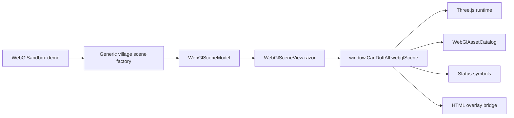
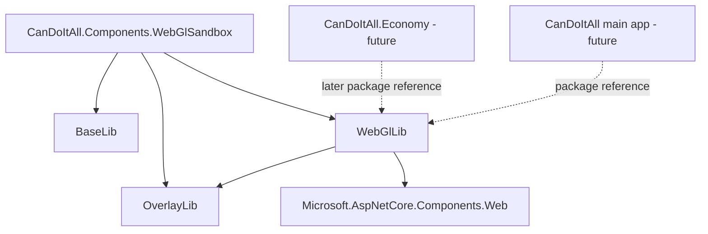

# 02 - Target architecture

## Core design

The existing `WebGlWorkbench` is workbench/node/edge oriented. It should remain stable.

Add a new generic symbolic scene layer:



## Project boundaries



Forbidden dependencies:

```text
WebGlLib -> Economy
WebGlLib -> Processes
WebGlSandbox -> Processes
WebGlSandbox -> Economy
WebGlSandbox -> main CanDoItAll app
```

## Folder layout

Target additions:

```text
src/CanDoItAll.Components.WebGlLib/
  Components/
    Scene/
      WebGlSceneView.razor
      WebGlSceneOverlayHost.razor
  WebGl/
    Scene/
      WebGlSceneModel.cs
      WebGlSceneObject.cs
      WebGlSceneLink.cs
      WebGlSceneCamera.cs
      WebGlSceneEnvironment.cs
      WebGlSceneProofSnapshot.cs
    Assets/
      WebGlAssetCatalog.cs
      WebGlAssetDefinition.cs
      WebGlAssetVariant.cs
      WebGlAssetAnimation.cs
      IWebGlAssetCatalogProvider.cs
      InMemoryWebGlAssetCatalogProvider.cs
      WebGlAssetCatalogValidator.cs
    Symbols/
      WebGlStatusSymbol.cs
      WebGlSymbolAnchor.cs
      WebGlSymbolEffect.cs
      WebGlSymbolIntensityPolicy.cs
      IWebGlSymbolPolicy.cs
      DefaultWebGlSymbolPolicy.cs
    Interaction/
      WebGlSceneSelectionState.cs
      WebGlSceneSelectionChangedEventArgs.cs
      WebGlSceneHoverChangedEventArgs.cs
      WebGlSceneCommand.cs
      WebGlInteractionOptions.cs
    Interop/
      WebGlRuntimeOptions.cs
      WebGlRuntimeDiagnostics.cs
      WebGlRuntimeReadyEventArgs.cs
      WebGlRuntimeErrorEventArgs.cs
  wwwroot/
    js/
      runtime/
        scene/
          01-webgl-scene.js
          02-webgl-scene-core.js
          03-webgl-scene-assets.js
          04-webgl-scene-symbols.js
          05-webgl-scene-interaction.js
          06-webgl-scene-camera.js
          07-webgl-scene-overlays.js
          08-webgl-scene-proof.js
    css/
      scene/
        webgl-scene.css

src/CanDoItAll.Components.WebGlSandbox/
  CanDoItAll.Components.WebGlSandbox.csproj
  Program.cs
  Components/
    App.razor
    Layout/
      MainLayout.razor
    Pages/
      Home.razor
      TycoonVillage.razor
      AssetCatalog.razor
  WebGlSandboxVillageSceneFactory.cs
  WebGlSandboxAssetCatalogFactory.cs
  wwwroot/
    sandbox-webgl.css
```

## Why add a new scene layer instead of extending `WebGlWorkbenchSurface`

`WebGlWorkbenchSurface` currently has useful proof infrastructure, but its conceptual vocabulary is anchored in nodes, edges, anchors, workbench presets, and process-like visual kinds. A tycoon-style visualization needs objects, buildings, agents, props, symbols, terrain, effects, and semantic overlays.

Therefore:

- Keep `WebGlWorkbenchSurface` for compatibility.
- Add `WebGlSceneModel` for generic 3D visualization.
- Later, create `WebGlWorkbenchSceneAdapter` only if useful.

## Runtime namespaces

Existing:

```js
window.CanDoItAll.webglWorkbench
```

New:

```js
window.CanDoItAll.webglScene
```

The two runtimes can share helper patterns but must not accidentally share mutable runtime state.
