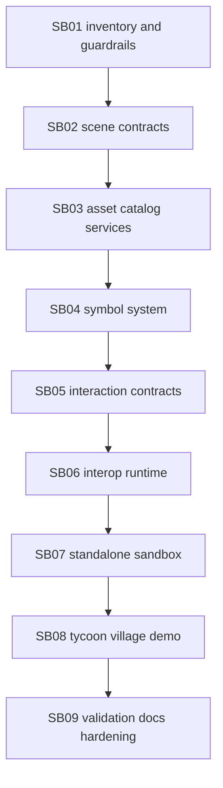

# WebGL Tycoon Sandbox Phase Plan

## Dependency Map

## Critical Foundations

| Subbundle | Critical foundation | Why it gates later work |
|---|---:|---|
| SB01 | Yes | Establishes additive workbench guardrails, asset inventory, and forbidden dependencies before code changes. |
| SB02 | Yes | Defines the domain-neutral scene model consumed by runtime, sandbox, proof snapshots, and future adapters. |
| SB03 | Yes | Defines logical asset resolution and fallback behavior that keeps GLB failures from breaking render proof. |
| SB06 | Yes | Owns the new runtime namespace, component bridge, disposal behavior, and browser-visible scene rendering. |
| SB08 | Yes | Provides the concrete visual proof scene required by the user request. |
| SB09 | Yes | Closes the bundle with builds, screenshots, dependency proof, and documentation. |

## Phase Gates

| Subbundle | Status | Entry gate | Closure gate |
|---|---|---|---|
| SB01 | Completed | Bundle root and source references present. | Inventory artifact exists and guardrails are recorded. |
| SB02 | Completed | SB01 complete. | DTOs compile and serialize with `JsonSerializerDefaults.Web`. |
| SB03 | Completed | SB02 contracts available. | Catalog provider/validator compile and missing assets are non-fatal. |
| SB04 | Completed | SB02 object contract available. | Symbols normalize generic effects and can appear in snapshots. |
| SB05 | Completed | SB02 selection state shape available. | Scene-specific event args compile without changing workbench events. |
| SB06 | Completed | SB02-SB05 complete. | `window.CanDoItAll.webglScene` renders, updates, disposes, and produces proof snapshots. |
| SB07 | Completed | SB06 component and assets available. | New sandbox project builds and references only allowed component libraries. |
| SB08 | Completed | SB07 app builds. | `/tycoon-village` renders village objects, symbols, selection, inspector, and proof snapshot. |
| SB09 | Completed | SB08 browser proof captured. | Required builds, asset checks, screenshots, docs, report, and dependency checks are complete. |
