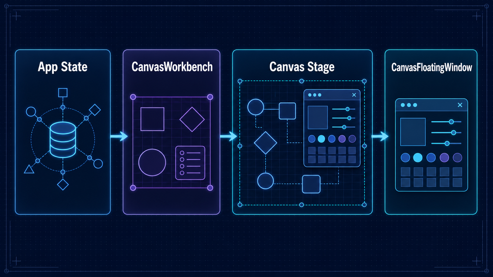
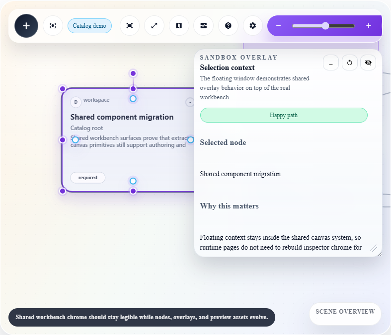

# Building interactive workspaces with CanvasLib

CanvasLib is for a different class of UI from a conventional form or dashboard. A Canvas workbench is an interactive surface: users select, arrange, navigate, inspect, and create relationships while remaining in one focused workspace. This guide describes the boundary that keeps those applications maintainable.



## The mental model

Keep application truth in .NET and use CanvasLib as the renderer and interaction host.

1. Map your domain records to `CanvasWorkbenchSurface`, its nodes, links, chrome, and `CanvasWorkbenchUiState`.
2. Render the typed surface with `CanvasWorkbench`.
3. Handle component callbacks by applying business rules, updating your state, and persisting it when appropriate.
4. Render tool windows inside `OverlayContent` and retain their `CanvasWorkbenchWindowState` alongside the rest of the UI state.

The browser runtime draws and manages the stage; it does not become the source of truth for domain data. This makes a reload, navigation, collaboration update, or server-side validation a normal state-management problem instead of a canvas-specific exception.

## When to choose it

Choose CanvasLib when the primary task benefits from spatial work: mapping dependencies, arranging plans, authoring a graph, inspecting a network, or operating a dense calendar. It earns its complexity when selection, viewport position, movable context, and visual relationships are part of the user task.

Do not choose it just to decorate a standard settings, list/detail, table, or form flow. Start with BaseLib in those cases. Add an OverlayLib window only when a page-local tool genuinely needs to stay open over the existing content.

## Host integration

Add `CanvasLibHeadAssets` and `CanvasLibBodyAssets` once in `App.razor`. The generated asset components establish the correct order for CanvasLib and OverlayLib assets. Avoid copying individual runtime scripts into the application.

```razor
<head>
    ...
    <CanvasLibHeadAssets />
</head>
<body>
    ...
    <CanvasLibBodyAssets IncludeRuntimeAssets="true"
                         IncludeCalendarAssets="true" />
</body>
```

## State responsibilities

`CanvasWorkbenchUiState` is designed to travel with the surface. It includes selected and highlighted node IDs, collapsed nodes, group frames, manual positions, zoom/pan, active inspector state, minimap/diagnostic flags, and a dictionary of window states. Persist the parts that make sense for the workflow; do not assume every pointer move must be immediately saved to your backend.

For a stable implementation:

- Use durable IDs for nodes, links, and windows.
- Treat `SelectionChanged`, `NodesMoved`, `NodeEdited`, `ContextActionRequested`, and `ClipboardRequested` as application commands, not persistence mechanisms.
- Normalize `CanvasWorkbenchWindowState` when receiving it from `StateChanged`.
- Restore saved UI state only after validating it against the currently available domain data.

## Adding a floating inspector

Place canvas-specific windows in `CanvasWorkbench.OverlayContent`. The `CanvasFloatingWindow` wrapper is already restricted to the canvas stage and below the workbench toolbar. Its state type makes it natural to persist a user's chosen geometry with `CanvasWorkbenchUiState.WindowStates`.

```razor
<CanvasWorkbench Surface="@surface">
    <OverlayContent>
        <CanvasFloatingWindow WindowId="node-inspector"
                              Title="Node details"
                              State="@inspector"
                              StateChanged="SaveInspectorState">
            @* Render your domain-specific inspector here. *@
        </CanvasFloatingWindow>
    </OverlayContent>
</CanvasWorkbench>

@code {
    private CanvasWorkbenchWindowState inspector = new();

    private Task SaveInspectorState(CanvasWorkbenchWindowState next)
    {
        inspector = CanvasWorkbenchWindowState.Normalize(next);
        surface.UiState.WindowStates["node-inspector"] = inspector;
        return Task.CompletedTask;
    }
}
```

For a support panel over a normal BaseLib page, use `OverlayWindow` instead. It has the same core runtime but takes `OverlayWindowState` and explicit host selectors, so its boundary is the ordinary page frame rather than a canvas stage.



## Accessibility and validation

Treat a Canvas workspace as an interaction surface, not a picture. Include accessible names and useful node labels, keep important actions reachable from the provided controls, test keyboard behavior, and verify empty, dense, and constrained states. Check that floating windows do not conceal primary work or drift outside the stage after resize and restoration.

The Sandbox at `/groups/canvas` is the starting proof surface: it shows the production-style workbench, selection context, and overlapping canvas windows. Use `/groups/overlays` to compare the same floating-window runtime in an ordinary page frame.

## Further reference

- [CanvasLib package README](../../src/CanDoItAll.Components.CanvasLib/README.md)
- [OverlayLib package README](../../src/CanDoItAll.Components.OverlayLib/README.md)
- [Canvas runtime asset map](../../src/CanDoItAll.Components.CanvasLib/Canvas/README.md)
